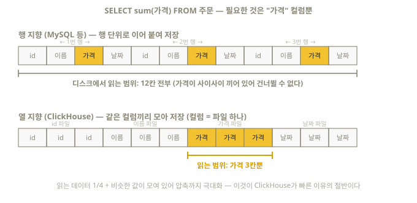

# 1장. 데이터베이스 첫걸음 — 아무것도 모르는 상태에서 시작하기

> 이 장은 데이터베이스를 한 번도 다뤄본 적 없는 사람을 위한 장이다.
> 이미 다른 DB(MySQL, PostgreSQL 등)를 써봤다면 1.4절부터 읽어도 된다.

## 1.1 데이터베이스란 무엇인가

**데이터베이스(database, DB)**는 데이터를 체계적으로 저장하고 꺼내 쓰는 소프트웨어다.
엑셀 시트를 떠올리면 된다. 엑셀 파일 하나가 "데이터베이스", 그 안의 시트 하나가
**테이블(table)**이다.

테이블은 **행(row)**과 **열(column)**로 이루어진다.

| user_id | name  | signup_date | country |
|---------|-------|-------------|---------|
| 1       | 김철수 | 2026-01-15  | KR      |
| 2       | Jane  | 2026-02-20  | US      |
| 3       | 田中   | 2026-03-05  | JP      |

- **행(row)** = 데이터 한 건 (위 표에서 "김철수"에 대한 줄 전체)
- **열(column)** = 데이터의 속성 (user_id, name, ...) — 각 열은 **데이터 타입**(숫자, 문자열, 날짜 등)을 가진다

엑셀과 결정적으로 다른 점:

1. **크기** — 엑셀은 100만 행이 한계지만, DB는 수십억~수조 행을 다룬다
2. **질의 언어** — 마우스로 클릭하는 대신 **SQL**이라는 언어로 "명령"해서 데이터를 다룬다
3. **동시성** — 수천 명이 동시에 읽고 써도 안전하다

## 1.2 SQL이란 무엇인가

**SQL(Structured Query Language)**은 데이터베이스에게 일을 시키는 표준 언어다.
프로그래밍 언어보다 훨씬 쉽다. 영어 문장에 가깝기 때문이다.

```sql
SELECT name, country FROM users WHERE country = 'KR';
```

읽는 법: "users 테이블**에서**(FROM) country가 'KR'인 행**만 골라서**(WHERE)
name과 country 열**을 보여줘**(SELECT)."

SQL 문장의 종류는 크게 넷이다:

| 종류 | 대표 명령 | 하는 일 |
|------|-----------|---------|
| 조회 | `SELECT` | 데이터 읽기 (가장 많이 씀) |
| 조작 | `INSERT`, `DELETE`, `UPDATE` | 데이터 넣기/지우기/고치기 |
| 정의 | `CREATE`, `ALTER`, `DROP` | 테이블 자체를 만들기/바꾸기/없애기 |
| 제어 | `GRANT`, `REVOKE` | 권한 관리 |

> 📌 SQL 문장 끝에는 세미콜론(`;`)을 붙인다. 대문자/소문자는 구분하지 않지만
> (SELECT = select), 관례상 SQL 키워드는 대문자로 쓴다.

## 1.3 OLTP vs OLAP — 데이터베이스의 두 세계

데이터베이스는 용도에 따라 두 진영으로 나뉜다. **이 구분을 이해하는 것이
ClickHouse를 이해하는 첫 단추다.**

### OLTP (Online Transaction Processing) — "거래 처리"

은행 계좌 이체, 쇼핑몰 주문, 회원 가입 같은 **건별 처리**에 특화된 DB.

- 특징: 한 번에 **소수의 행**을 읽고 쓴다. "김철수의 잔액을 1만 원 줄여라"
- 절대 조건: 정확성 (이체 도중 서버가 죽어도 돈이 증발하면 안 됨 → 트랜잭션)
- 대표 제품: MySQL, PostgreSQL, Oracle

### OLAP (Online Analytical Processing) — "분석 처리"

"지난 1년간 국가별 월 매출 추이", "오늘 접속자 중 재방문자 비율" 같은
**대량 데이터 집계·분석**에 특화된 DB.

- 특징: 한 번에 **수억~수십억 행을 읽고** 합계/평균 등으로 요약한다
- 절대 조건: 속도 (분석가가 쿼리를 던지고 몇 초 안에 답이 와야 함)
- 대표 제품: **ClickHouse**, BigQuery, Snowflake, Druid

| 비교 | OLTP | OLAP |
|------|------|------|
| 전형적 질문 | "주문번호 1234의 상태는?" | "지난달 시간대별 평균 주문액은?" |
| 한 쿼리가 만지는 행 | 1~수백 행 | 수백만~수십억 행 |
| 쓰기 패턴 | 한 건씩 자주 | 대량을 한꺼번에 (배치/스트림) |
| 수정(UPDATE) | 빈번, 필수 | 드묾 (넣고 나면 거의 안 고침) |
| 대표 주자 | MySQL, PostgreSQL | **ClickHouse** |

**ClickHouse는 OLAP 데이터베이스다.** 그래서 뒤에서 배우겠지만 "행 하나 고치기"는
어렵고 느린 대신, "10억 행 집계"는 노트북에서도 1초 안에 끝난다.

## 1.4 컬럼 지향 저장 — ClickHouse가 빠른 이유

전통적 DB(MySQL 등)는 데이터를 **행 단위**로 디스크에 저장한다(row-oriented).
ClickHouse는 **열 단위**로 저장한다(column-oriented). 이 차이가 속도의 핵심이다.

책장에 비유하면 이렇다. 행 지향은 "주문서 한 장 한 장"을 순서대로 꽂아둔 서류철이고,
열 지향은 주문서를 분해해서 **"가격만 모은 파일", "날짜만 모은 파일"**로 나눠 꽂아둔
서류철이다. "이번 달 평균 가격"을 구하라는 요청이 오면, 전자는 주문서를 전부 꺼내
가격 칸만 훑어야 하지만 후자는 가격 파일 하나만 꺼내면 끝난다.

디스크 위에서 실제로 벌어지는 일을 그림으로 보자:



정리하면, 분석 쿼리 `SELECT sum(가격) ...`을 실행할 때:

- **행 지향**: 가격이 다른 컬럼들 사이사이에 끼어 있어 **모든 행의 모든 컬럼**을 읽게 된다
- **열 지향**: `가격` 파일 **하나만** 읽으면 된다 → 컬럼이 100개인 테이블이라면 읽는 데이터가 1/100로 줄어든다

여기에 두 가지 이점이 더해진다:

1. **압축** — 같은 열에는 비슷한 값이 모여 있다 (`KR, KR, US, KR, JP...`).
   비슷한 값이 모이면 압축이 극단적으로 잘 된다. 디스크에서 읽을 바이트 자체가 줄어든다.
2. **벡터화 실행** — 값을 한 개씩이 아니라 수천 개 단위 블록으로 CPU에 밀어 넣어
   SIMD 명령으로 한꺼번에 처리한다.

> 반대급부: "user_id가 1인 행 전체를 보여줘"는 열 지향에서 오히려 불리하다
> (모든 컬럼 파일을 각각 열어야 하므로). OLTP에 ClickHouse를 쓰지 않는 이유다.

## 1.5 ClickHouse는 어떤 DB인가

- 2009년 러시아 Yandex에서 웹 분석 서비스(Metrica)용으로 개발 시작, **2016년 오픈소스** 공개
- 2021년 ClickHouse, Inc. 분사 (본사 미국) — 현재 개발과 자격증 운영 주체
- 이름의 유래: **Click**stream(클릭 로그) + Data ware**House**
- C++로 작성된 컬럼 지향 OLAP DBMS. 단일 바이너리 하나로 서버/클라이언트/로컬 도구가 전부 들어 있다
- 버전 체계: `YY.M` (예: 26.8 = 2026년 8월 릴리스). 매달 릴리스, 매년 두 번(대략 3월/8월) LTS
- 쓰는 곳: Cloudflare(초당 수백만 이벤트), Uber(로그 분석), eBay, Tesla, 국내 다수 기업의 로그/이벤트 분석

**ClickHouse가 잘하는 것**: 로그·이벤트·시계열·클릭스트림 분석, 실시간 대시보드,
대량 데이터 집계.
**못(안) 하는 것**: 건별 트랜잭션(계좌 이체), 빈번한 행 단위 UPDATE, 외래 키 제약.

## 1.6 이 책의 학습 방법

1. **모든 예제를 직접 실행하라.** 시험이 실기다. 눈으로만 읽으면 반드시 떨어진다.
2. 2장에서 실습 환경(`clickhouse local`)을 만든 뒤, 각 장의 SQL을 복사-실행-변형해 볼 것.
3. 모르는 함수가 나오면 [공식 문서](https://clickhouse.com/docs)에서 검색하는 습관을 들일 것.
   시험장에서도 문서를 열어볼 수 있다 — 문서와 친해지는 것 자체가 시험 준비다.

## 이해도 체크

```quiz
Q: ClickHouse는 어떤 종류의 데이터베이스인가?
1) OLTP — 건별 거래 처리에 특화
2) OLAP — 대량 데이터 집계·분석에 특화 *
3) 키-값 저장소
E: ClickHouse는 수억~수십억 행을 읽어 요약하는 분석(OLAP)에 특화됐다. 계좌 이체 같은 건별 트랜잭션은 MySQL 같은 OLTP의 영역이다 (1.3절).
```

```quiz
Q: 열 지향 저장이 분석 쿼리에서 빠른 근본 이유는?
1) 메모리를 더 많이 쓰기 때문
2) 쿼리에 필요한 컬럼의 파일만 골라 읽을 수 있어서 *
3) 행을 정렬하지 않기 때문
E: 컬럼마다 별도 파일로 저장되므로 sum(가격) 같은 쿼리는 가격 파일 하나만 읽는다. 행 지향은 필요 없는 컬럼까지 통째로 읽어야 한다 (1.4절).
```

```quiz
Q: 열 지향 저장에서 압축이 극단적으로 잘 되는 이유는?
1) 같은 컬럼에는 비슷한 값이 모여 있어서 *
2) 데이터를 무조건 절반으로 자르기 때문
3) 문자열을 저장하지 않기 때문
E: 'KR, KR, US, KR...'처럼 비슷한 값이 연속되면 압축 알고리즘이 힘을 발휘한다. 실측에서 LowCardinality 컬럼은 208배까지 압축됐다 (1.4절, 6.3절).
```

```quiz
Q: 다음 중 ClickHouse에 맡기면 안 되는 작업은?
1) 수십억 행 로그의 시간대별 집계
2) 실시간 대시보드의 데이터 소스
3) 은행 계좌 이체 (건별 트랜잭션) *
E: part가 불변인 구조라 빈번한 행 단위 수정·트랜잭션에는 부적합하다. "넣고 집계"가 ClickHouse의 무대다 (1.3, 1.5절).
```
