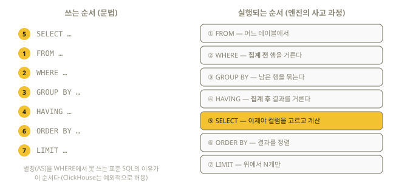

# 3장. SQL 첫걸음 — 처음 쓰는 쿼리

> 이 장이 끝나면 SELECT / INSERT / CREATE의 기본기를 갖추게 된다.
> 모든 예제는 2장에서 만든 실습 환경(`./clickhouse local`)에서 그대로 실행된다.

## 3.1 가장 작은 쿼리

테이블 없이도 쿼리는 실행된다. 계산기처럼 써보자.

```sql
SELECT 1 + 1 AS answer;
-- ┌─answer─┐
-- │      2 │
-- └────────┘

SELECT now() AS current_time, today() AS current_date;

SELECT 'Hello, ClickHouse!' AS greeting;
```

문법 요소 셋을 기억하자:

- `SELECT` 뒤에 **보고 싶은 것**을 쉼표로 나열한다
- `AS 별칭`으로 결과 컬럼에 이름을 붙인다 (별칭에 한글을 쓰려면 백틱 필요: ``AS `지금` ``)
- 문자열은 **작은따옴표** `'...'` — 큰따옴표 `"..."`는 문자열이 아니라 식별자(컬럼/테이블 이름)용이다

## 3.2 연습용 테이블 만들기

```sql
CREATE TABLE menu (
    name     String,   -- 메뉴 이름
    category String,   -- 분류
    price    UInt32,   -- 가격 (원)
    spicy    Bool      -- 매운지 여부
) ENGINE = Memory;
```

- `CREATE TABLE 이름 ( 컬럼명 타입, ... )` — 각 컬럼은 반드시 **타입**을 가진다 (4장에서 총정리)
- `ENGINE = Memory` — ClickHouse 테이블은 반드시 **엔진**을 지정한다. 엔진은 "데이터를
  어떻게 저장하고 읽을지"를 정하는 방식이다. `Memory`는 메모리에만 두는 연습용 엔진이고,
  **실전은 거의 항상 `MergeTree`**다(5장). 지금은 문법에 집중하자.

만든 테이블 확인:

```sql
SHOW TABLES;
DESCRIBE menu;        -- 컬럼 구조 보기 (DESC menu 도 동일)
SHOW CREATE TABLE menu;  -- 생성 SQL 전체 보기
```

## 3.3 데이터 넣기 — INSERT

```sql
INSERT INTO menu VALUES
    ('김치찌개', '한식', 9000,  true),
    ('돈까스',   '일식', 11000, false),
    ('마라탕',   '중식', 13000, true),
    ('파스타',   '양식', 15000, false),
    ('비빔밥',   '한식', 10000, false);
```

- 값의 순서는 테이블 컬럼 순서와 같아야 한다
- 일부 컬럼만 넣으려면 `INSERT INTO menu (name, price) VALUES ('라면', 5000);`
  (나머지는 타입의 기본값 — 문자열은 `''`, 숫자는 `0`)

## 3.4 데이터 읽기 — SELECT의 6가지 부품

```sql
SELECT   컬럼들          -- ① 무엇을 볼까
FROM     테이블          -- ② 어디서
WHERE    행 조건         -- ③ 어떤 행만 (필터)
GROUP BY 묶을 기준       -- ④ 묶어서 집계할까
HAVING   집계 결과 조건  -- ⑤ 집계 결과를 다시 필터
ORDER BY 정렬 기준       -- ⑥ 어떤 순서로
LIMIT    개수            -- ⑦ 몇 개만
```

쓰는 순서와 실행되는 순서가 다르다는 것이 SQL 이해의 첫 열쇠다 — 엔진은 항상
FROM(어디서)부터 생각한다:



하나씩 실행해 보자.

### 전체 조회와 필터

```sql
-- 전부 보기 (*는 "모든 컬럼")
SELECT * FROM menu;

-- 조건: 11,000원 이하이면서 맵지 않은 것
SELECT * FROM menu
WHERE price <= 11000 AND NOT spicy
ORDER BY price;
-- ┌─name───┬─category─┬─price─┬─spicy─┐
-- │ 비빔밥 │ 한식     │ 10000 │ false │
-- │ 돈까스 │ 일식     │ 11000 │ false │
-- └────────┴──────────┴───────┴───────┘
```

WHERE에서 쓰는 연산자:

| 연산자 | 의미 | 예 |
|--------|------|----|
| `=`, `!=` (`<>`) | 같다 / 다르다 | `category = '한식'` |
| `<`, `<=`, `>`, `>=` | 크기 비교 | `price >= 10000` |
| `AND`, `OR`, `NOT` | 조건 결합 | `spicy AND price < 14000` |
| `IN` | 목록 중 하나 | `category IN ('한식', '일식')` |
| `BETWEEN` | 범위 (양끝 포함) | `price BETWEEN 9000 AND 13000` |
| `LIKE` | 문자열 패턴 (%=아무거나) | `name LIKE '%찌개'` |

### 정렬과 개수 제한

```sql
-- 비싼 순 상위 3개
SELECT name, price, if(spicy, 'O', '') AS is_spicy
FROM menu
ORDER BY price DESC   -- DESC 내림차순, ASC(기본) 오름차순
LIMIT 3;
-- ┌─name───┬─price─┬─is_spicy─┐
-- │ 파스타 │ 15000 │          │
-- │ 마라탕 │ 13000 │ O        │
-- │ 돈까스 │ 11000 │          │
-- └────────┴───────┴──────────┘
```

`if(조건, 참일때, 거짓일때)`는 ClickHouse의 조건 함수다 (10장).

### 묶어서 집계 — GROUP BY

**집계(aggregation)**는 여러 행을 하나의 요약값으로 줄이는 것이다.
ClickHouse의 존재 이유가 바로 이것이다.

```sql
SELECT
    category,
    count()    AS cnt,        -- 행 개수
    avg(price) AS avg_price   -- 평균
FROM menu
GROUP BY category
ORDER BY avg_price DESC;
-- ┌─category─┬─cnt─┬─avg_price─┐
-- │ 양식     │   1 │     15000 │
-- │ 중식     │   1 │     13000 │
-- │ 일식     │   1 │     11000 │
-- │ 한식     │   2 │      9500 │
-- └──────────┴─────┴───────────┘
```

규칙: **SELECT에 나오는 컬럼은 ① GROUP BY에 있거나 ② 집계 함수로 감싸져 있어야 한다.**
(category는 ①, count/avg는 ②)

집계 결과를 다시 필터하려면 WHERE가 아니라 `HAVING`:

```sql
SELECT category, count() AS cnt
FROM menu
GROUP BY category
HAVING cnt >= 2;    -- "2개 이상인 분류만"
```

> WHERE는 **집계 전** 행을 거르고, HAVING은 **집계 후** 결과를 거른다.

## 3.5 데이터 지우기/테이블 없애기

```sql
-- 특정 행 삭제 — ⚠️ MergeTree 계열 전용 (지금의 menu는 Memory 엔진이라 에러가 난다!
-- "DELETE query is not supported" — 행 삭제는 14장에서 MergeTree로 제대로 배운다)
-- DELETE FROM menu WHERE name = '라면';

-- 모든 행 비우기 (Memory 엔진에서도 동작)
TRUNCATE TABLE menu;

-- 테이블 자체 삭제
DROP TABLE menu;

-- 데이터베이스 삭제
DROP DATABASE IF EXISTS shop;
```

`IF EXISTS` / `IF NOT EXISTS`를 붙이면 "없는 걸 지우려 해서 나는 에러"를 방지한다.
스크립트에서 자주 쓰는 습관이다:

```sql
CREATE TABLE IF NOT EXISTS menu (...) ENGINE = Memory;
```

## 3.6 결과 출력 형식 — FORMAT

ClickHouse는 쿼리 끝에 `FORMAT 이름`을 붙여 출력 모양을 바꾼다.
(다른 DB에는 없는, ClickHouse 특유의 강력한 기능이다. 9장에서 파일 입출력과 함께 자세히.)

```sql
SELECT * FROM menu LIMIT 2 FORMAT PrettyCompact;  -- 표 형태 (대화형 기본)
SELECT * FROM menu LIMIT 2 FORMAT CSV;            -- CSV
SELECT * FROM menu LIMIT 2 FORMAT JSONEachRow;    -- 한 행에 JSON 하나
SELECT * FROM menu LIMIT 2 FORMAT Vertical;       -- 컬럼이 많을 때 세로로
```

## 3.7 자주 하는 실수 모음 (전부 실제로 겪게 된다)

1. **문자열에 큰따옴표** — `WHERE name = "김치찌개"` ❌ → `'김치찌개'` ⭕
   (큰따옴표는 식별자용이므로 "그런 컬럼 없음" 에러가 난다)
2. **GROUP BY 빠뜨림** — `SELECT category, count() FROM menu` ❌
   → 집계 함수와 일반 컬럼을 섞으면 GROUP BY가 필요하다
3. **HAVING 자리에 WHERE** — 집계 결과(cnt 등) 조건은 HAVING에
4. **한글/특수문자 별칭에 백틱 누락** — ``SELECT 1 AS `개수` `` 처럼 백틱으로 감싼다
5. **ENGINE 빠뜨림** — ClickHouse의 CREATE TABLE은 ENGINE이 필수다
   (MySQL 습관으로 생략하면 에러)

## 연습문제

1. `menu`에 원하는 메뉴 2개를 INSERT 해보라.
2. 한식이 아닌 메뉴 중 가장 싼 것 1개를 조회하라. (`ORDER BY` + `LIMIT`)
3. 매운 메뉴(`spicy = true`)의 평균 가격을 구하라.
4. 분류별 최고가 메뉴 가격을 구하되, 최고가가 12,000원 이상인 분류만 보여라. (`max` + `HAVING`)

<details>
<summary>정답 예시</summary>

```sql
-- 2번
SELECT * FROM menu WHERE category != '한식' ORDER BY price ASC LIMIT 1;
-- 3번
SELECT avg(price) FROM menu WHERE spicy;
-- 4번
SELECT category, max(price) AS max_price FROM menu
GROUP BY category HAVING max_price >= 12000;
```
</details>

## 이해도 체크

```quiz
Q: 집계 결과(예: count() >= 2)를 조건으로 걸려면 어디에 쓰는가?
1) WHERE
2) HAVING *
3) ORDER BY
E: WHERE는 집계 "전" 행을 거르고, HAVING은 GROUP BY 집계 "후" 결과를 거른다. 실행 순서(FROM→WHERE→GROUP BY→HAVING)를 기억하자 (3.4절).
```

```quiz
Q: 문자열 리터럴의 올바른 표기는?
1) WHERE name = "김치찌개"
2) WHERE name = '김치찌개' *
3) WHERE name = 김치찌개
E: 작은따옴표가 문자열이다. 큰따옴표는 컬럼·테이블 이름(식별자)용이라 "그런 컬럼 없음" 에러가 난다 (3.1, 3.7절).
```

```quiz
Q: SELECT 문에서 엔진이 가장 먼저 실행하는 절은?
1) SELECT
2) FROM *
3) LIMIT
E: 쓰는 순서와 달리 실행은 FROM(어디서)→WHERE→GROUP BY→HAVING→SELECT→ORDER BY→LIMIT 순이다 (3.4절 다이어그램).
```

```quiz
Q: ClickHouse의 CREATE TABLE에서 MySQL과 달리 반드시 지정해야 하는 것은?
1) PRIMARY KEY
2) ENGINE *
3) CHARSET
E: ClickHouse 테이블은 반드시 엔진(Memory, MergeTree 등)을 지정한다. 실전은 거의 항상 MergeTree다 (3.2절).
```
