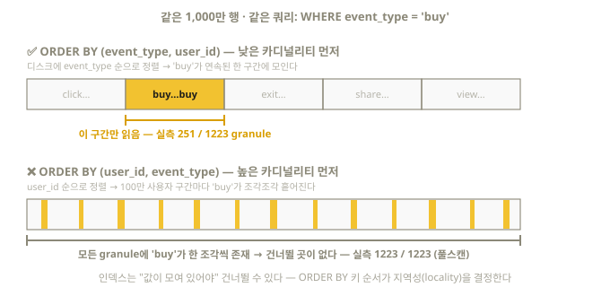

# 6장. 테이블 설계 — ORDER BY 키, TTL, 압축

> 시험 영역 1의 두 번째 축: "쿼리 유형에 맞는 효율적인 primary key 정의".
> 그리고 실무 설계의 나머지 축인 TTL과 압축 codec을 함께 다룬다.

## 6.1 ORDER BY 키 설계 — 공식 규칙 4가지

ClickHouse 공식 best practice가 제시하는 규칙은 명확하다:

1. **WHERE에 자주 등장하는 컬럼**을 키로 골라라 (쿼리 패턴이 출발점)
2. **카디널리티(고유값 수)가 낮은 컬럼을 앞에** 둬라
   — 예: `(event_type[5종], user_id[100만], timestamp)` 순
3. 키는 **4~5개면 대개 충분**하다 (공식 문구: "4-5 typically sufficient" —
   뒤쪽 키는 효과가 급감한다)
4. GROUP BY 대상 컬럼이 키에 있으면 집계도 빨라진다 (정렬된 데이터의 부수 효과)

이 규칙들은 서로 충돌할 수 있다 — 공식 가이드는 **위 순서대로 우선순위를 두고**
판단하라고 명시한다.

### 왜 "낮은 카디널리티 먼저"인가 — 실측 증명

같은 1,000만 행(이벤트 5종 × 사용자 100만)을 두 가지 순서로 저장하고
`WHERE event_type = 'buy'`를 실행한 결과:

| ORDER BY | 읽은 granule | 의미 |
|----------|--------------|------|
| `(event_type, user_id)` ✅ | **251 / 1223** | 'buy' 구간만 정확히 읽음 (~1/5) |
| `(user_id, event_type)` ❌ | **1223 / 1223** | 풀스캔 — 인덱스 무용지물 |

5배 가까운 차이가 왜 나는지, 디스크에 놓인 데이터의 모습으로 보면 명확하다:



첫 번째 키가 `user_id`면 'buy'가 100만 사용자 구간마다 한 조각씩 흩어져 있어,
모든 granule에 'buy'가 최소 하나씩 존재한다 — 건너뛸 수 있는 granule이 없다.
첫 번째 키가 `event_type`이면 'buy'가 한 구간에 모여 있어 나머지 4/5를 통째로
건너뛴다. 앞 키로 정렬된 큰 구간 안에서만 뒷 키가 정렬되므로,
**뒤 키 단독 필터는 효과가 약하다** — 이것이 "낮은 카디널리티 먼저" 규칙의 정체다.

### 설계 절차 (시험에서 그대로 쓰는 사고 과정)

1. 문제에서 요구하는 대표 쿼리를 확인한다 — 예: "특정 event_type의 기간별 집계"
2. WHERE 대상 컬럼을 나열한다 — `event_type`, `event_time`
3. 카디널리티 낮은 순으로 배열한다 — `ORDER BY (event_type, event_time)`
4. `EXPLAIN indexes = 1`로 `Granules: x/y` 를 확인해 검증한다

### 시간 컬럼은 어디에 두나

- 대부분의 쿼리가 "타입/테넌트 필터 + 시간 범위"라면: `(type, timestamp)` — 시간을 뒤에
- 거의 항상 최근 데이터만 본다면 timestamp를 앞에 둘 수도 있지만, 그러면 다른 필터가
  죽는다. 일반적으로는 **저카디널리티 필터 → 시간** 순서가 표준이다

## 6.2 TTL — 데이터 수명 자동 관리

오래된 데이터를 자동으로 지우거나 옮긴다. (검증: 26.8)

```sql
-- 행 단위: 90일 지나면 삭제
CREATE TABLE metrics (
    ts        DateTime,
    sensor_id UInt32,
    value     Float64,
    raw_payload String TTL ts + INTERVAL 1 DAY   -- 컬럼 단위: 1일 뒤 이 컬럼만 기본값으로
) ENGINE = MergeTree
ORDER BY (sensor_id, ts)
TTL ts + INTERVAL 90 DAY DELETE;   -- DELETE는 기본 동작이라 생략 가능
```

변형들:

```sql
-- 기존 테이블에 추가/변경
ALTER TABLE metrics MODIFY TTL ts + INTERVAL 180 DAY;

-- 오래된 데이터를 값싼 디스크/볼륨으로 이동 (계층형 스토리지)
TTL ts + INTERVAL 30 DAY TO DISK 'cold',
    ts + INTERVAL 365 DAY DELETE

-- 오래된 데이터를 집계본으로 축약 (roll-up)
TTL ts + INTERVAL 30 DAY GROUP BY sensor_id SET value = avg(value)

-- 오래된 데이터를 더 강한 압축으로 재압축
TTL ts + INTERVAL 30 DAY RECOMPRESS CODEC(ZSTD(9))
```

주의: TTL 적용은 **merge 시점**에 일어난다 — 시간이 지났다고 즉시 지워지지 않는다.
기존 part에 TTL 규칙을 소급 적용하려면 `ALTER TABLE metrics MATERIALIZE TTL;`,
만료분을 즉시 정리하려면 `OPTIMIZE TABLE metrics FINAL;`.

TTL의 제약 3가지 (시험 함정):

1. **컬럼 TTL은 키(ORDER BY/PARTITION BY) 컬럼에 걸 수 없다**
2. `TTL ... GROUP BY`의 그룹 키는 **primary key의 접두사**여야 한다
3. TTL 식에 `now()` 같은 비결정적 함수를 넣으면 merge마다 재평가되어 삭제 시점이
   예측 불가능해진다

효율 팁: 파티션 키와 TTL 날짜 컬럼을 맞추고 `SETTINGS ttl_only_drop_parts = 1`을
켜면, 행 단위 재작성 없이 **만료된 part를 통째로 drop**한다 (대용량 시계열의 표준 구성).

## 6.3 압축 codec — 컬럼별 맞춤 압축

기본 압축은 셀프 호스팅이 LZ4(빠름), **ClickHouse Cloud는 ZSTD(1)**이다.
컬럼 특성에 맞는 codec을 지정하면 극적으로 줄어든다.

```sql
CREATE TABLE metrics (
    ts    DateTime CODEC(DoubleDelta, ZSTD),  -- codec 체인: 변환 후 압축
    value Float64  CODEC(Gorilla, ZSTD),
    body  String   CODEC(ZSTD(3))
) ENGINE = MergeTree ORDER BY ts;
```

우선순위에 주의: 공식 실험에서 **타입 최소화 + ORDER BY 설계만으로 50GB → 25GB**를
만든 뒤에야 codec을 손댔다. codec은 마지막 단계의 미세 조정이다.

| Codec | 적합한 데이터 | 원리 |
|-------|---------------|------|
| `LZ4` (기본) | 범용 | 빠른 압축/해제 |
| `ZSTD(레벨 1~22)` | 범용, 더 높은 압축률 | 압축률↑ CPU↑ (레벨 3 안팎이 실용적) |
| `Delta` | 조금씩 증가하는 정수 | 이전 값과의 차이만 저장 |
| `DoubleDelta` | 일정 간격의 타임스탬프 | 차이의 차이 저장 (등차수열이면 거의 0) |
| `Gorilla` | 천천히 변하는 Float (센서값) | XOR 기반 |
| `T64` | 실제 범위가 좁은 정수 | 공통 상위 비트 제거 |
| `NONE` | 이미 압축된 데이터 (이미지 등) | 무압축 |

관용 패턴: 시계열 타임스탬프 = `CODEC(DoubleDelta, ZSTD)`,
센서 Float = `CODEC(Gorilla, ZSTD)`, 증가 ID = `CODEC(Delta, ZSTD)`.

두 가지 주의:

- `Delta`/`DoubleDelta`/`GCD`는 **데이터 준비용 codec**이라 단독으로는 의미가 없고
  뒤에 범용 codec(LZ4/ZSTD)을 붙여야 한다
- codec이 **역효과**를 낼 수도 있다 — 공식 실측에서 단조 증가하는 ID는
  `Delta, ZSTD`로 압축비 1.42→3.43 개선됐지만, 들쭉날쭉한 값(ViewCount)은
  5.05→4.22로 **악화**됐다. 적용 후 `system.parts_columns`로 반드시 확인하라 (16장)

압축 효과 확인 쿼리 (실측 — 26.8):

```sql
SELECT
    column,
    formatReadableSize(sum(column_data_compressed_bytes))   AS compressed,
    formatReadableSize(sum(column_data_uncompressed_bytes)) AS uncompressed,
    round(sum(column_data_uncompressed_bytes) / sum(column_data_compressed_bytes), 1) AS ratio
FROM system.parts_columns
WHERE table = 'big' AND active
GROUP BY column
ORDER BY sum(column_data_compressed_bytes) DESC;
-- name(무작위 문자열): 4.2배 | id(연속 정수): 2배 | tag(LowCardinality 3종): 208배
```

## 6.4 DEFAULT / MATERIALIZED / ALIAS 컬럼

```sql
CREATE TABLE t (
    url    String,
    -- INSERT에서 생략하면 이 값이 들어감
    status UInt16 DEFAULT 200,
    -- 항상 자동 계산되어 "저장"됨 (INSERT로 직접 넣을 수 없음)
    domain String MATERIALIZED domain(url),
    -- 저장 안 하고 조회 때마다 계산 (가상 컬럼)
    is_https Bool ALIAS startsWith(url, 'https')
) ENGINE = MergeTree ORDER BY url;
```

- `MATERIALIZED`: 디스크를 쓰지만 조회가 빠르다 — 자주 조회하는 파생값
- `ALIAS`: 디스크 0 — 가끔 쓰는 편의 표현
- `SELECT *`에는 MATERIALIZED/ALIAS 컬럼이 **나오지 않는다** (이름을 직접 지정해야 조회됨)

## 6.5 설계 종합 예제 — 시험 스타일

요구사항: "웹 로그를 저장하라. 주요 쿼리는 ① 특정 status code의 최근 1시간 조회
② 도메인별 일간 요청 수. 데이터는 90일 보관."

```sql
CREATE TABLE web_logs (
    ts       DateTime CODEC(DoubleDelta, ZSTD),
    status   UInt16,                        -- 100~599, UInt8 불가!
    method   LowCardinality(String),        -- GET/POST/... 소수
    domain   LowCardinality(String),
    path     String,
    bytes    UInt32,
    client_ip IPv4
) ENGINE = MergeTree
PARTITION BY toYYYYMM(ts)
ORDER BY (status, ts)                       -- 대표 쿼리 ①에 맞춤
TTL ts + INTERVAL 90 DAY;
```

②(도메인별 집계)는 ORDER BY로 커버되지 않는다 → 14~15장의
Materialized View 또는 Projection으로 해결한다. **"모든 쿼리를 하나의 ORDER BY로
잡을 수 없을 때 무엇을 추가하는가"가 시험 영역 4의 주제다.**
