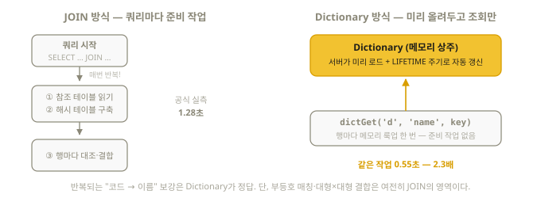

# 7장. Dictionary — JOIN 없이 하는 초고속 조회

> 시험 영역 1의 마지막 항목: "define and query a dictionary".
> Dictionary는 "키 → 속성" 조회 전용의 **메모리 상주 참조 테이블**이다.

## 7.1 왜 필요한가

분석 쿼리에는 "코드 → 이름" 변환이 끝없이 나온다 (국가코드→국가명, 상품ID→상품명).
JOIN으로 풀 수도 있지만, ClickHouse에서 JOIN은 상대적으로 비싼 연산이다.
Dictionary는 참조 데이터를 **메모리에 올려두고 함수 호출 한 번으로** 조회한다.



## 7.2 만들기 — CREATE DICTIONARY (26.8 검증)

```sql
-- 원천 테이블 (이미 있다고 가정)
CREATE TABLE countries_src (
    code      String,
    name      String,
    continent String
) ENGINE = MergeTree ORDER BY code;

INSERT INTO countries_src VALUES
    ('KR', 'South Korea', 'Asia'),
    ('US', 'United States', 'North America');

-- Dictionary 정의
CREATE DICTIONARY countries_dict (
    code      String,
    name      String,
    continent String
)
PRIMARY KEY code
SOURCE(CLICKHOUSE(TABLE 'countries_src'))   -- 어디서 읽어올까
LAYOUT(COMPLEX_KEY_HASHED())                -- 메모리에 어떻게 둘까
LIFETIME(MIN 0 MAX 300);                    -- 0~300초 사이 무작위 시점마다 자동 갱신
-- 자동 갱신을 끄려면 LIFETIME(0)
```

구성 요소 4가지:

| 절 | 역할 | 대표값 |
|----|------|--------|
| `PRIMARY KEY` | 조회 키 | 단일/복합 키 |
| `SOURCE(...)` | 데이터 원천 | `CLICKHOUSE(TABLE '...')`, `HTTP(URL '...' FORMAT '...')`, `FILE(PATH '...' FORMAT '...')`, `MYSQL(...)`, `POSTGRESQL(...)` |
| `LAYOUT(...)` | 메모리 구조 | 아래 표 |
| `LIFETIME(...)` | 자동 갱신 주기(초) | `LIFETIME(300)` 또는 `MIN 0 MAX 300` (구간 내 무작위 — 갱신 폭주 방지) |

### LAYOUT 선택 기준

| LAYOUT | 키 조건 | 특징 |
|--------|---------|------|
| `FLAT()` | **UInt64 키**, 최대값 작음(기본 ~50만) | 배열 인덱싱 — 가장 빠름 |
| `HASHED()` | UInt64 키 | 해시맵 — 무난한 기본값 |
| `COMPLEX_KEY_HASHED()` | **문자열/복합 키** | String 키면 이것 (위 예제) |
| `CACHE(SIZE_IN_CELLS n)` | UInt64 키 | 일부만 캐시 — 원천이 너무 클 때 |
| `RANGE_HASHED()` | 키 + 기간(시작~끝) | "이 날짜에 유효한 값" 조회 (환율, 요금제) |
| `IP_TRIE()` | IP prefix | IP → 국가/ASN 매핑 |

> 키가 UInt64면 FLAT/HASHED, String이면 COMPLEX_KEY_HASHED — 이것만 기억해도
> 시험은 충분하다. (키 타입과 LAYOUT이 안 맞으면 생성 시 에러가 난다)

RANGE_HASHED는 문법이 다르다 — `RANGE(MIN ... MAX ...)` 절이 추가되고 조회 시
시점 인자를 하나 더 넘긴다:

```sql
CREATE DICTIONARY discounts_dict (
    advertiser_id UInt64,
    start_date    Date,
    end_date      Date,
    amount        Float64
)
PRIMARY KEY advertiser_id
SOURCE(CLICKHOUSE(TABLE 'discounts'))
LAYOUT(RANGE_HASHED())
LIFETIME(MIN 60 MAX 300)
RANGE(MIN start_date MAX end_date);

-- 4번째 인자 = "이 시점에 유효한 값"
SELECT dictGet('discounts_dict', 'amount', toUInt64(1), toDate('2026-08-15'));
```

SOURCE에는 테이블 대신 **쿼리**도 넣을 수 있다 — 집계 결과를 사전으로 굳히는
공식 패턴이다 (문서 실측: JOIN 1.28초 → dictGet 0.55초):

```sql
SOURCE(CLICKHOUSE(QUERY
    'SELECT post_id, countIf(v = 2) AS up, countIf(v = 3) AS down
     FROM votes GROUP BY post_id'))
-- QUERY와 TABLE/WHERE는 함께 쓸 수 없다
```

## 7.3 조회하기 — dictGet 가족 (26.8 검증)

```sql
SELECT dictGet('countries_dict', 'name', 'KR');
-- 'South Korea'

-- 키가 없을 때 기본값
SELECT dictGetOrDefault('countries_dict', 'continent', 'XX', 'Unknown');
-- 'Unknown'

-- 존재 확인
SELECT dictHas('countries_dict', 'KR');    -- 1

-- 여러 속성 한 번에 (Tuple 반환)
SELECT dictGet('countries_dict', ('name', 'continent'), 'KR');

-- 실전: 이벤트 테이블에 국가명 붙이기 (JOIN 없이!)
SELECT
    dictGet('countries_dict', 'name', country) AS country_name,
    count() AS cnt
FROM events
GROUP BY country_name;
```

인자 순서: `dictGet('사전이름', '속성이름', 키)`. 타입별 변형
(`dictGetString`, `dictGetUInt64` 등)도 있지만 범용 `dictGet`이면 대부분 충분하다.

## 7.4 테이블처럼 다루기

```sql
-- Dictionary는 SELECT로 직접 읽을 수도 있다
SELECT * FROM countries_dict;

-- 상태·메모리 사용량·적재 시각 확인
SELECT name, status, element_count, last_successful_update_time
FROM system.dictionaries;

-- 수동 갱신
SYSTEM RELOAD DICTIONARY countries_dict;
```

## 7.5 언제 Dictionary, 언제 JOIN?

| 상황 | 선택 |
|------|------|
| 참조 데이터가 메모리에 들어감 (수천만 키까지도 실용적) + 키 등가 조회 | **Dictionary** |
| 참조 데이터가 가끔 바뀜 (분 단위 이상 주기) | Dictionary (LIFETIME 자동 갱신 — 단, 갱신은 기본적으로 **전체 재로드**라 대용량+고빈도 변경엔 부적합) |
| 부등호 조건, 복잡한 매칭, 대형×대형 결합 | JOIN (9장) |
| 시점별 유효값 (환율 등) | Dictionary + RANGE_HASHED |

> Cloud 참고: ClickHouse Cloud에서는 XML 설정 방식 사전은 불가하고 위의
> **DDL(CREATE DICTIONARY) 방식만** 지원된다. `SOURCE(FILE(...))`은 서버의
> `user_files` 디렉토리 안 파일만 허용된다.

시험 팁: 문제에 "dictionary를 만들어 조회하라"가 명시되면 위 7.2 문형을 그대로 쓰면
된다. 은근한 함정은 **키 타입과 LAYOUT 불일치** (String 키 + HASHED → 에러 →
COMPLEX_KEY_HASHED로 교체)다.

## 이해도 체크

```quiz
Q: 키가 String인 Dictionary에 맞는 LAYOUT은?
1) FLAT()
2) HASHED()
3) COMPLEX_KEY_HASHED() *
E: FLAT/HASHED는 UInt64 키 전용이다. 문자열·복합 키는 COMPLEX_KEY_ 계열 — 키 타입과 LAYOUT이 안 맞으면 생성 시 에러가 난다 (7.2절).
```

```quiz
Q: `LIFETIME(0)`의 의미는?
1) 0초마다 갱신 (실시간)
2) 자동 갱신 안 함 *
3) 0초 후 사전 삭제
E: 0은 "갱신 끔"이다. `LIFETIME(MIN 0 MAX 300)`은 반대로 0~300초 사이 무작위 시점마다 갱신한다 — 헷갈리기 쉬운 지점 (7.2절).
```

```quiz
Q: dictGet의 올바른 인자 순서는?
1) dictGet(키, 속성, 사전이름)
2) dictGet('사전이름', '속성이름', 키) *
3) dictGet('속성이름', '사전이름', 키)
E: 사전 → 속성 → 키 순서다. 키가 없을 때 기본값을 원하면 dictGetOrDefault('d', 'attr', key, '기본값') (7.3절).
```

```quiz
Q: "환율처럼 날짜 구간별로 유효한 값"을 조회하려면?
1) LAYOUT(FLAT()) + dictGet 3인자
2) LAYOUT(RANGE_HASHED()) + RANGE(MIN...MAX...) + 시점 인자 추가 *
3) Dictionary로는 불가능
E: RANGE_HASHED는 RANGE 절로 유효 구간을 선언하고, dictGet에 4번째 인자로 시점을 넘긴다 (7.2절).
```
