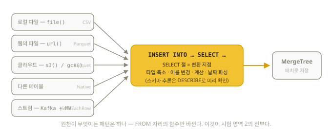

# 8장. 데이터 삽입 — 시험 영역 2 완전 정복

> 시험 영역 2: 로컬 파일 삽입, 클라우드 스토리지(S3) 삽입, Parquet/CSV/TSV,
> **삽입 중 컬럼 변환**, 테이블 간 복사. 전부 이 장에 있다.

이 장의 내용은 많아 보이지만, 사실 **패턴은 단 하나**다. 데이터가 로컬 파일에 있든
S3에 있든 다른 테이블에 있든, 전부 `INSERT INTO ... SELECT ...` 한 문장으로 수렴하고,
원천에 따라 FROM 자리의 함수만 바뀐다. 그리고 변환(타입 축소, 이름 변경, 계산)은
전부 SELECT 절에서 일어난다. 이 지도를 머리에 넣고 시작하자:



## 8.1 INSERT의 네 가지 형태

```sql
-- ① 값 직접 나열
INSERT INTO t VALUES (1, 'a'), (2, 'b');
INSERT INTO t (id, name) VALUES (3, 'c');          -- 일부 컬럼만

-- ② 다른 테이블에서 (테이블 간 복사 — 시험 문형)
INSERT INTO t_new SELECT * FROM t_old WHERE id > 100;

-- ③ 파일/외부 소스에서 (8.3절)
INSERT INTO t SELECT * FROM file('data.csv', 'CSVWithNames');

-- ④ 클라이언트로 파일 흘려넣기
-- (셸에서) cat data.csv | clickhouse-client --query "INSERT INTO t FORMAT CSVWithNames"
INSERT INTO t FROM INFILE 'data.csv' FORMAT CSVWithNames;   -- 클라이언트 문법
```

### 대량 삽입 원칙 (5장 복습 + 공식 권장)

- 배치 크기 공식 권장: **최소 1,000행, 이상적으로 10,000~100,000행.** INSERT 하나가 part 하나다
- 같은 데이터를 같은 순서로 재시도하는 동기 INSERT는 (Replicated 테이블에서)
  블록 단위로 중복 제거되므로 안전하게 재시도할 수 있다 (14.6)
- 배치를 만들 수 없는 환경(웹훅 등)이면 **비동기 삽입**을 켜라 — 서버가 대신 모아서 쓴다:

```sql
INSERT INTO t SETTINGS async_insert = 1, wait_for_async_insert = 1 VALUES (...);
-- wait_for_async_insert = 1: 디스크 기록까지 확인 (기본, 안전)
--                        0: 버퍼 진입만 확인 (빠르지만 유실 가능)
-- ⚠️ async_insert는 INSERT ... SELECT 계열에는 적용되지 않는다 (항상 동기 실행)
```

## 8.2 파일 포맷 — FORMAT 절

| 포맷 | 용도 | 비고 |
|------|------|------|
| `CSV` | 쉼표 구분 | 헤더 없음 |
| `CSVWithNames` | 〃 | **1행이 헤더** — 실무 CSV는 대부분 이것 |
| `TabSeparated` (=`TSV`) | 탭 구분 | 헤더 없음 |
| `TabSeparatedWithNames` (=`TSVWithNames`) | 〃 | 1행 헤더 |
| `Parquet` | 컬럼형 바이너리 | 데이터 레이크 표준. 압축·타입 보존 |
| `JSONEachRow` | 한 줄 = JSON 객체 하나 | 로그 파이프라인 표준 |
| `Native` | ClickHouse 내부 포맷 | CH ↔ CH 전송에 최속 |
| `Pretty`/`PrettyCompact`/`Vertical` | 사람 눈용 출력 | SELECT 전용 |

포맷은 세 곳에서 쓰인다:

```sql
SELECT * FROM t FORMAT JSONEachRow;                          -- 출력 모양
INSERT INTO t FORMAT CSVWithNames                            -- 입력 해석 (데이터가 뒤따름)
SELECT * FROM file('x.parquet', 'Parquet');                  -- 테이블 함수의 2번째 인자
```

파일로 내보내기/불러오기 (26.8 검증):

```sql
SELECT * FROM t INTO OUTFILE 'out.parquet' FORMAT Parquet;   -- 확장자로 포맷 추론도 됨
INSERT INTO t FROM INFILE 'out.parquet' FORMAT Parquet;
```

## 8.3 테이블 함수 — 파일을 테이블처럼

**테이블 함수(table function)**는 FROM 자리에 쓰는 "즉석 테이블"이다.

### file() — 로컬 파일 (26.8 검증)

```sql
-- 파일을 바로 쿼리 (테이블 생성조차 필요 없다!)
SELECT * FROM file('fruits.csv', 'CSVWithNames') WHERE price > 1000;

-- 포맷 생략 시 확장자로 추론
SELECT count() FROM file('data.parquet');

-- glob 패턴: 여러 파일 한 번에
SELECT * FROM file('logs/2026-08-*.csv', 'CSVWithNames');
```

경로 기준: `clickhouse local`은 현재 디렉토리, 서버는 설정의 `user_files_path`
(기본 `/var/lib/clickhouse/user_files/`) 기준이다.
⚠️ **ClickHouse Cloud에서는 file()이 지원되지 않는다** — Cloud 실습은 s3()/url()로
대체하라 (예: `s3('https://...', NOSIGN)`).

glob으로 여러 파일을 읽을 때는 가상 컬럼 `_file`(파일명), `_path`, `_size`, `_time`으로
출처를 추적할 수 있다 (file/url/s3 공통):

```sql
SELECT _file, count() FROM file('logs/2026-08-*.csv', 'CSVWithNames') GROUP BY _file;
INSERT INTO events SELECT *, _file AS source_file FROM s3('https://bucket/sales/*.parquet', NOSIGN);
```

### url() — HTTP의 파일

```sql
SELECT count()
FROM url('https://example.com/data/file.parquet', 'Parquet');
```

### s3() — 클라우드 스토리지 ★ (시험 명시 영역, 26.8 검증)

```sql
-- 공개 버킷 (인증 불필요: NOSIGN)
SELECT count()
FROM s3('https://datasets-documentation.s3.eu-west-3.amazonaws.com/house_parquet/house_0.parquet', NOSIGN);
-- 2772030

-- 비공개 버킷 (액세스 키 인증)
SELECT * FROM s3(
    'https://my-bucket.s3.amazonaws.com/data/*.parquet',
    'AWS_ACCESS_KEY_ID', 'AWS_SECRET_ACCESS_KEY',
    'Parquet'
) LIMIT 10;

-- S3로 내보내기 (INSERT INTO FUNCTION)
INSERT INTO FUNCTION s3('https://my-bucket.s3.amazonaws.com/export/out.parquet',
                        'KEY', 'SECRET', 'Parquet')
SELECT * FROM events;
```

인자 순서: `s3(url [, 인증] [, 포맷] [, 구조])`. GCS는 `gcs()`,
Azure는 `azureBlobStorage()`로 같은 패턴이다. 클러스터 병렬 읽기는 `s3Cluster()`.

### 기타 유용한 테이블 함수

```sql
SELECT * FROM numbers(10);                        -- 0~9 (테스트 데이터의 원천)
SELECT * FROM generateRandom('id UInt32, name String') LIMIT 5;   -- 무작위 데이터
SELECT * FROM values('id UInt32, name String', (1, 'a'), (2, 'b'));
```

## 8.4 스키마 추론 — DESCRIBE로 미리 보기 (26.8 검증)

파일 구조를 모를 때, ClickHouse가 타입을 자동 추론한다:

```sql
DESCRIBE file('fruits.csv');
-- id    Nullable(Int64)
-- name  Nullable(String)
-- price Nullable(Int64)
```

- CSV/TSV 같은 **텍스트 포맷**의 추론 결과는 **Nullable + 큰 타입(Int64)**으로
  나온다 — 안전 우선이기 때문 (제어 설정: `schema_inference_make_columns_nullable`,
  힌트 제공: `schema_inference_hints`)
- **시험 포인트**: "효율적인 타입의 테이블을 만들라"는 과제에서 추론 결과를 그대로
  베끼면 감점 요인이다. 추론은 참고만 하고, 4장 원칙(작은 타입, Nullable 제거,
  LowCardinality)으로 직접 선언하라
- Parquet은 파일에 타입 정보가 있어 추론이 정확하다 (`DESCRIBE s3(...)`도 동일하게 동작)

## 8.5 삽입 중 컬럼 변환 ★★ (시험 명시: "transforming columns during insert")

표준 패턴은 **INSERT INTO ... SELECT + 변환식**이다 (26.8 검증):

```sql
-- 원본 CSV: id, name, price(원화)
-- 목표 테이블: id, name_upper, price_usd
CREATE TABLE fruits (
    id         UInt32,
    name_upper String,
    price_usd  Float64
) ENGINE = MergeTree ORDER BY id;

INSERT INTO fruits
SELECT
    id,                    -- 그대로
    upper(name),           -- 변환 (이름도 바뀌는 셈 — 위치 순서대로 매칭)
    price / 1300           -- 계산
FROM file('fruits.csv', 'CSVWithNames');
```

날짜 문자열 파싱, 타입 변환, 조건 가공 등 무엇이든 SELECT 절에서 처리한다:

```sql
INSERT INTO events
SELECT
    parseDateTimeBestEffort(ts_str)      AS event_time,
    toUInt32(uid)                        AS user_id,
    lower(type)                          AS event_type,
    if(dur = '', 0, toUInt32OrZero(dur)) AS duration_ms
FROM file('raw_events.tsv', 'TabSeparatedWithNames');
```

### input() — 클라이언트 스트림 변환

파일이 서버가 아니라 **클라이언트 쪽**에 있고, 흘려넣으면서 변환할 때:

```bash
cat raw.csv | clickhouse-client --query "
INSERT INTO events
SELECT parseDateTimeBestEffort(ts), toUInt32(uid)
FROM input('ts String, uid String') FORMAT CSV"
```

`input('스키마')`는 "지금 흘러들어오는 데이터"를 테이블처럼 취급하는 함수다.

## 8.6 시험용 종합 시나리오

"S3의 Parquet 파일을 받아, 날짜별 정렬 테이블에 컬럼명을 바꾸고 타입을 줄여 넣어라":

```sql
-- ① 구조 파악
DESCRIBE s3('https://bucket.s3.amazonaws.com/sales/*.parquet', NOSIGN);

-- ② 효율적 타입으로 테이블 설계
CREATE TABLE sales (
    sale_date  Date,
    product_id UInt32,
    qty        UInt16,
    price      Decimal(18, 2)
) ENGINE = MergeTree ORDER BY (product_id, sale_date);

-- ③ 변환하며 삽입
INSERT INTO sales
SELECT
    toDate(order_ts)   AS sale_date,     -- DateTime → Date
    toUInt32(pid)      AS product_id,    -- 이름 + 타입 변경
    toUInt16(quantity) AS qty,
    amount             AS price
FROM s3('https://bucket.s3.amazonaws.com/sales/*.parquet', NOSIGN);

-- ④ 검증 습관
SELECT count(), min(sale_date), max(sale_date) FROM sales;
```
