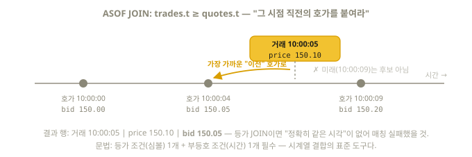

# 9장. SELECT 심화 — JOIN, CTE, 그리고 ClickHouse만의 무기

> 3장의 기본기 위에, 시험 영역 3("Analyzing data")을 풀기 위한 나머지 문법을 얹는다.

## 9.1 WITH — CTE(공통 테이블 표현식)

복잡한 쿼리를 이름 붙인 단계로 나눈다. 가독성의 핵심 도구.

```sql
WITH big_orders AS (
    SELECT user_id, amount FROM orders WHERE amount >= 5000
)
SELECT user_id, count() FROM big_orders GROUP BY user_id;

-- 상수 정의로도 쓴다
WITH 1300 AS usd_rate
SELECT price / usd_rate AS usd FROM products;
```

⚠️ ClickHouse의 CTE는 결과를 캐싱하지 않는다 — **참조할 때마다 서브쿼리가
다시 실행**된다. 무거운 집계를 CTE로 빼고 두 번 참조하면 두 번 돈다 (비결정적
데이터면 두 참조의 결과가 다를 수도 있다 — 26.8 실측). 한 번만 실행하려면:

```sql
WITH cte AS MATERIALIZED (SELECT ...)   -- 결과를 실체화해 재사용
SELECT ... SETTINGS enable_materialized_cte = 1;
```

## 9.2 JOIN — 테이블 결합

```sql
SELECT u.name, o.amount
FROM orders AS o
INNER JOIN users AS u ON o.user_id = u.id;
```

### 종류 (26.8 검증)

| JOIN | 결과 |
|------|------|
| `INNER` | 양쪽에 짝이 있는 행만 |
| `LEFT [OUTER]` | 왼쪽 전부 + 짝 없으면 오른쪽은 기본값(0, '') — ⚠️ NULL이 아니라 **타입 기본값**이 기본 동작 (`join_use_nulls = 1` 설정 시 NULL) |
| `RIGHT [OUTER]` / `FULL [OUTER]` | 반대 방향 / 양쪽 전부 |
| `CROSS` | 모든 조합 (조건 없음) |
| `LEFT SEMI` | 짝이 "있는" 왼쪽 행만 (오른쪽 컬럼 불필요할 때) |
| `LEFT ANTI` | 짝이 "없는" 왼쪽 행만 (실측: 고아 주문 찾기) |
| `ANY` (예: `LEFT ANY JOIN`) | 오른쪽에 중복 키가 있어도 **첫 매칭 하나만** — 기본(`ALL`)은 매칭 수만큼 행이 불어난다 |
| `ASOF` | **가장 가까운 이전 시점** 매칭 (시계열 필수 무기) |

### ASOF JOIN — 시계열의 비밀 병기 (26.8 검증)

"거래 시점 직전의 호가를 붙여라" 같은 비등가 시간 매칭:



```sql
SELECT tr.sym, tr.t, tr.price, q.bid
FROM trades tr
ASOF JOIN quotes q
ON tr.sym = q.sym AND tr.t >= q.t;   -- 등가 조건 1개 + 부등호 조건 1개 필수
-- 각 trade에 "그 시각 이전의 가장 최근 quote"가 붙는다
```

### ClickHouse JOIN의 성능 상식

- 기본은 해시 계열 조인(기본 설정값 `direct,parallel_hash,hash`):
  **오른쪽 테이블을 메모리에 올린다** → **작은 테이블을 오른쪽에**가 원칙.
  단, 최신 버전(24.12+)은 플래너가 작은 쪽을 자동으로 오른쪽에 재배치해 주므로
  "원칙은 이해하되, 대체로 알아서 해준다" 정도로 알면 된다
- 메모리가 부족하면 `SETTINGS join_algorithm = 'grace_hash'`(디스크 스필) 또는
  `'full_sorting_merge'` — 구자료에 나오는 `partial_merge`는 공식 문서가
  "아주 느림"으로 표기한 최후 수단이다
- 반복되는 코드→이름 조회는 JOIN 대신 **Dictionary**(7장)
- 존재 여부만 필요하면 JOIN 대신 `IN`:

```sql
SELECT name FROM users
WHERE id IN (SELECT user_id FROM orders WHERE amount >= 5000);
```

## 9.3 ARRAY JOIN — 배열 펼치기 (26.8 검증)

배열 한 개를 행 여러 개로 펼친다. 태그, 다중값 분석의 표준 도구.

```sql
SELECT name, tag
FROM (SELECT 'kim' AS name, ['vip', 'new'] AS tags)
ARRAY JOIN tags AS tag;
-- kim | vip
-- kim | new
```

- `LEFT ARRAY JOIN`: 빈 배열 행도 유지 (tag는 기본값)
- 함수형 대안: `arrayJoin(tags)` — SELECT 절 안에서 같은 효과

## 9.4 집계를 더 편하게 — ClickHouse 확장 문법

```sql
-- 그룹별 상위 N개: LIMIT n BY (26.8 검증 — 시험 단골)
SELECT region, product, amount
FROM sales
ORDER BY region, amount DESC
LIMIT 2 BY region;         -- 지역마다 상위 2개씩

-- 소계·총계: WITH ROLLUP / CUBE / TOTALS (26.8 검증)
SELECT region, sum(amount) AS total
FROM sales GROUP BY region WITH ROLLUP;
-- ROLLUP: 그룹 키를 오른쪽부터 하나씩 지우며 "계층 소계"를 만든다.
-- GROUP BY a, b WITH ROLLUP → (a,b)별 + a별 소계 + 총계.
-- 키가 1개면 결과적으로 총계 한 행이 추가된 것처럼 보인다.
-- 총계 행만 원하면 WITH TOTALS.

-- 시계열 빈 구간 채우기: ORDER BY ... WITH FILL (대시보드 필수 기술)
SELECT toStartOfHour(ts) AS h, count() AS c
FROM events GROUP BY h
ORDER BY h WITH FILL
    FROM toStartOfHour(now() - INTERVAL 1 DAY)
    TO   toStartOfHour(now())
    STEP INTERVAL 1 HOUR;   -- 데이터 없는 시간대가 0으로 채워진다

-- 별칭을 WHERE/GROUP BY에서 바로 재사용 가능 (표준 SQL은 불가, ClickHouse는 가능)
SELECT toStartOfHour(ts) AS hour, count()
FROM events
GROUP BY hour             -- 별칭 사용 OK
ORDER BY hour;

-- 컬럼 선택 편의 문법
SELECT * EXCEPT (secret_col) FROM t;             -- 특정 컬럼 빼고 전부
SELECT COLUMNS('^user_') FROM t;                 -- 정규식으로 컬럼 선택
```

## 9.5 서브쿼리와 집합 연산

```sql
-- FROM 서브쿼리
SELECT avg(daily_cnt) FROM (
    SELECT toDate(ts) AS d, count() AS daily_cnt FROM events GROUP BY d
);

-- 집합 연산
SELECT id FROM t1 UNION ALL      SELECT id FROM t2;  -- 전부 (중복 유지)
SELECT id FROM t1 UNION DISTINCT SELECT id FROM t2;  -- 중복 제거
SELECT id FROM t1 INTERSECT      SELECT id FROM t2;  -- 교집합
SELECT id FROM t1 EXCEPT         SELECT id FROM t2;  -- 차집합
```

## 9.6 일반 View와 Parameterized View (26.8 검증)

```sql
-- 일반 View: 쿼리에 이름 붙이기 (저장 안 함 — 12장 MV와 다름)
CREATE VIEW paid_orders AS
SELECT * FROM orders WHERE status = 'paid';

-- Parameterized View: 파라미터 있는 뷰
CREATE VIEW orders_by_status AS
SELECT * FROM orders WHERE status = {st:String};

SELECT * FROM orders_by_status(st = 'paid');
```

## 9.7 시험형 연습

"국가별로 매출 상위 3개 상품과, 각 상품의 매출 비중(%)을 구하라" 같은 복합 문제는
CTE + LIMIT BY + 윈도우 함수(11장)의 조합으로 푼다:

```sql
WITH product_sales AS (
    SELECT country, product, sum(amount) AS revenue
    FROM sales
    GROUP BY country, product
)
SELECT
    country,
    product,
    revenue,
    round(100 * revenue / sum(revenue) OVER (PARTITION BY country), 1) AS pct
FROM product_sales
ORDER BY country, revenue DESC
LIMIT 3 BY country;
```

## 이해도 체크

```quiz
Q: "주문한 적 없는 사용자"처럼 짝이 "없는" 왼쪽 행만 남기는 JOIN은?
1) LEFT SEMI JOIN
2) LEFT ANTI JOIN *
3) CROSS JOIN
E: ANTI는 매칭 실패한 행만, SEMI는 매칭 성공한 왼쪽 행만 남긴다 (9.2절).
```

```quiz
Q: LEFT JOIN에서 짝이 없는 오른쪽 컬럼에 기본적으로 들어가는 값은?
1) NULL
2) 타입 기본값 (0, 빈 문자열) *
3) 에러가 난다
E: ClickHouse의 기본 동작은 NULL이 아니라 타입 기본값이다. 표준 SQL처럼 NULL을 원하면 `SETTINGS join_use_nulls = 1` (9.2절).
```

```quiz
Q: 무거운 집계를 CTE(WITH)로 빼고 두 번 참조하면?
1) 한 번만 실행되고 결과가 재사용된다
2) 참조할 때마다 다시 실행된다 — 두 번 돈다 *
3) 문법 오류가 난다
E: ClickHouse CTE는 캐싱하지 않는다 (26.8 실측). 한 번만 실행하려면 `WITH cte AS MATERIALIZED (...)` + enable_materialized_cte (9.1절).
```

```quiz
Q: "지역마다 매출 상위 2개 상품"을 뽑는 ClickHouse 고유 문법은?
1) TOP 2 PER region
2) ORDER BY region, amount DESC LIMIT 2 BY region *
3) GROUP BY region LIMIT 2
E: LIMIT n BY 그룹키 — 그룹마다 상위 n행을 남긴다. 윈도우 함수 row_number보다 간결한 시험 단골 (9.4절).
```

```quiz
Q: ASOF JOIN의 조건 구성 규칙은?
1) 부등호 조건만 여러 개
2) 등가 조건 1개 이상 + 부등호(시간) 조건 1개 *
3) 조건 없이 자동 매칭
E: 심볼 같은 등가 키로 짝 후보를 정하고, 부등호 조건으로 "가장 가까운 이전" 시점을 고른다 (9.2절).
```
