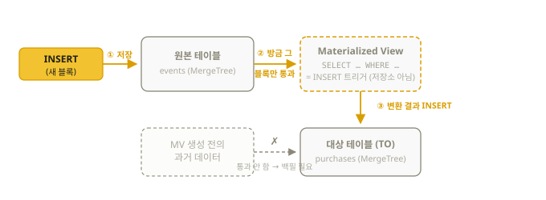
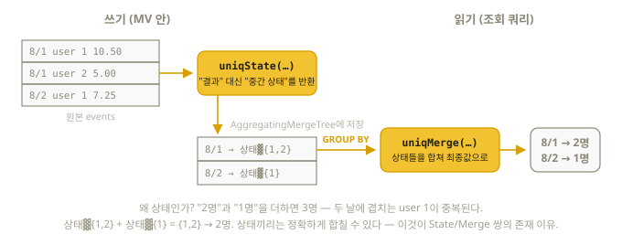

# 12장. Materialized View — 시험 영역 4의 주인공

> "같은 집계를 매번 다시 계산하지 말고, 미리 계산해 둬라."
> Materialized View(이하 MV)는 ClickHouse 성능 최적화의 첫 번째 도구이며,
> 시험 영역 4("Optimizing query performance")의 중심이다.

## 12.1 본질: MV는 "INSERT 트리거"다

이름 때문에 오해하기 쉽다. ClickHouse의 MV는 "저장된 뷰"가 아니라
**"원본 테이블에 INSERT가 일어날 때마다 실행되어, 그 결과를 다른 테이블에 쓰는 트리거"**다.

우체통에 비유하면: 원본 테이블이 우체통이고, MV는 우체통 입구에 달아둔 **자동 복사기**다.
새 편지가 들어오는 순간 조건에 맞으면 복사본을 만들어 옆의 보관함(대상 테이블)에 넣는다.
핵심은 복사기가 **"들어오는 순간"에만 작동**한다는 것 — 이미 우체통 안에 쌓여 있던
편지는 복사기를 단다고 해서 복사되지 않는다.



세 가지 결정적 성질이 이 그림에서 나온다:

1. **생성 이후의 INSERT에만 반응한다.** 이미 있던 데이터는 반영되지 않는다 (백필 필요)
2. 원본을 **다시 읽지 않는다.** 방금 들어온 블록만 SELECT의 입력이 된다 → 비용이 거의 0
3. 원본이 아니라 **"INSERT 스트림"에 붙는 것**이므로, MV의 SELECT에서 JOIN을 하면
   **왼쪽(원본) 테이블 INSERT에만** 트리거된다 — 오른쪽 테이블 변경은 무시

일반 View와 비교:

| | 일반 View | Materialized View |
|--|-----------|-------------------|
| 저장 | 안 함 (쿼리 별칭일 뿐) | 대상 테이블에 실제 저장 |
| 시점 | 조회할 때마다 원본 재계산 | INSERT 시점에 미리 계산 |
| 용도 | 쿼리 재사용/가독성 | **성능 최적화** |

## 12.2 표준 문법 — TO 방식 (권장)

```sql
-- ① 대상(target) 테이블을 먼저, 명시적으로 만든다
CREATE TABLE purchases (
    event_time DateTime,
    user_id    UInt32,
    page_url   String
) ENGINE = MergeTree
ORDER BY event_time;

-- ② MV를 대상 테이블에 연결(TO)한다
CREATE MATERIALIZED VIEW purchases_mv
TO purchases AS
SELECT event_time, user_id, page_url
FROM events
WHERE event_type = 'purchase';
```

`TO` 없이 만들면 `.inner_id.<uuid>` 형태의 숨은 테이블이 자동 생성되는데(내포 방식),
관리가 불편하고 **MV를 DROP하면 내포 테이블과 데이터까지 같이 사라진다.**
그래서 **실무·시험 모두 TO 방식이 표준**이다 (TO 방식은 MV를 지워도 대상 테이블 유지).

### 기존 데이터 채우기 (백필)

MV는 생성 이후만 반영하므로, 기존 데이터는 직접 넣는다. 그런데 "MV 생성"과
"수동 INSERT" 사이에 새 데이터가 들어오면 중복(또는 순서를 바꾸면 누락)이 생긴다.
공식 가이드의 표준은 **경계 시각**을 정해 두 경로를 나누는 것이다:

```sql
-- ① MV에 미래의 경계 시각 이후만 처리하도록 필터를 건다
CREATE MATERIALIZED VIEW purchases_mv TO purchases AS
SELECT event_time, user_id, page_url FROM events
WHERE event_type = 'purchase' AND event_time >= '2026-08-16 10:00:00';

-- ② 경계 이전 구간만 수동 백필 → 중복도 누락도 없다
INSERT INTO purchases
SELECT event_time, user_id, page_url FROM events
WHERE event_type = 'purchase' AND event_time < '2026-08-16 10:00:00';
```

(대상이 AggregatingMergeTree라면 백필 SELECT에도 `-State`를 써야 한다.)

`POPULATE` 옵션은 버전에 따라 동작이 다르다 — **26.8부터는 `TO ... POPULATE`가
허용되고 population 중 동시 INSERT도 정확히 한 번 전달**되도록 개선되었지만(26.8 실측
동작 확인), **26.7 이하(현행 LTS 포함)에서는 TO와 함께 쓰면 문법 오류**이고 유실
가능성도 있다. 어느 버전에서나 통하는 안전한 방법은 위의 경계 백필이다.

## 12.3 비집계 MV — 필터·변환 (시험 유형 그대로)

시험 문구: "define materialized view of **non-aggregated** query results".
위 12.2의 purchases_mv가 정확히 그것이다. 다른 흔한 용도:

```sql
-- 원본과 다른 정렬 순서의 사본 유지 (다른 쿼리 패턴 지원)
CREATE TABLE events_by_user (
    user_id UInt32, event_time DateTime, event_type LowCardinality(String), url String
) ENGINE = MergeTree
ORDER BY (user_id, event_time);          -- 원본은 (event_type, event_time)

CREATE MATERIALIZED VIEW events_by_user_mv TO events_by_user AS
SELECT user_id, event_time, event_type, url FROM events;
```

⚠️ **컬럼 이름 일치 규칙**: MV의 SELECT 결과 컬럼명(별칭 포함)이 대상 테이블
컬럼명과 일치해야 한다. 위치가 아니라 **이름으로** 매칭된다. 계산식에는 반드시
`AS 대상컬럼명`을 붙일 것 — MV가 소리 없이 기본값을 넣는 사고의 최다 원인이다.

## 12.4 집계 MV ① — SummingMergeTree

합계만 필요하면 가장 간단한 조합:

```sql
CREATE TABLE daily_revenue (
    day     Date,
    product LowCardinality(String),
    qty     UInt64,
    revenue UInt64
) ENGINE = SummingMergeTree((qty, revenue))   -- 이 컬럼들을 merge 때 합산
ORDER BY (day, product);                      -- 나머지 컬럼(키)이 같은 행끼리

CREATE MATERIALIZED VIEW daily_revenue_mv TO daily_revenue AS
SELECT
    toDate(event_time) AS day,
    product,
    qty,
    price * qty AS revenue
FROM orders;
```

⚠️ **merge는 "언젠가" 일어난다.** merge 전에는 같은 키의 행이 여러 개 존재할 수 있으므로,
조회는 **항상 GROUP BY + sum으로** 한다 (실측으로 확인된 동작):

```sql
SELECT day, product, sum(qty) AS qty, sum(revenue) AS revenue
FROM daily_revenue
GROUP BY day, product;
```

## 12.5 집계 MV ② — AggregatingMergeTree + State/Merge ★★★

합계 이외의 집계(고유 수, 평균, 분위수)는 왜 "중간 상태(state)"라는 개념이
필요할까? 합계는 부분값끼리 더하면 그만이지만(100+50=150), **고유 사용자 수는
"2명"과 "1명"을 더하면 틀린다** — 두 집합에 같은 사람이 겹칠 수 있기 때문이다.
그래서 "결과"가 아니라 "결과를 만들 수 있는 재료"(어떤 사용자들이 있었는지)를
저장해 뒀다가, 읽을 때 재료끼리 합쳐 최종값을 만든다. 이 재료가 **상태(state)**다.



이것이 **시험 영역 4의 핵심 문형이다.** 전체 흐름(26.8 검증):

```sql
-- ① 원본
CREATE TABLE events (
    ts      DateTime,
    user_id UInt32,
    revenue Decimal(18,2)
) ENGINE = MergeTree ORDER BY ts;

-- ② 대상 테이블: 집계 "상태"를 담는 특수 타입
CREATE TABLE daily_stats (
    day           Date,
    users         AggregateFunction(uniq, UInt32),          -- uniq의 중간 상태
    total_revenue SimpleAggregateFunction(sum, Decimal(38,2)) -- ⚠️ sum(Decimal(18,2))의 결과 타입은 (38,2)
) ENGINE = AggregatingMergeTree
ORDER BY day;                                               -- MV의 GROUP BY와 일치!

-- ③ MV: -State 접미사로 "상태"를 저장
CREATE MATERIALIZED VIEW daily_stats_mv TO daily_stats AS
SELECT
    toDate(ts)         AS day,
    uniqState(user_id) AS users,          -- uniq → uniqState
    sum(revenue)       AS total_revenue   -- SimpleAggregateFunction은 그냥 sum
FROM events
GROUP BY day;

-- ④ 조회: -Merge 접미사로 상태를 최종값으로 합침
SELECT
    day,
    uniqMerge(users)   AS unique_users,   -- uniqState로 쓴 것은 uniqMerge로 읽는다
    sum(total_revenue) AS revenue
FROM daily_stats
GROUP BY day
ORDER BY day;
-- 2026-08-01 | 2 | 15.5
-- 2026-08-02 | 1 | 7.25
```

암기 공식:

| 단계 | 문법 |
|------|------|
| 저장 타입 | `AggregateFunction(집계함수, 인자타입...)` |
| 쓰기(MV) | `집계함수State(...)` |
| 읽기 | `집계함수Merge(...)` + GROUP BY |

대표 쌍: `uniqState/uniqMerge`, `avgState/avgMerge`, `countState/countMerge`,
`argMaxState/argMaxMerge`. ⚠️ 파라미터형 함수는 **Merge 쪽에도 같은 파라미터**를
반복해야 한다 (26.8 실측): `quantilesState(0.5, 0.9)(x)` → `quantilesMerge(0.5, 0.9)(col)`.
빠뜨리면 `NUMBER_OF_ARGUMENTS_DOESNT_MATCH` 에러.

### SimpleAggregateFunction vs AggregateFunction

| | SimpleAggregateFunction | AggregateFunction |
|--|------------------------|-------------------|
| 조건 | 부분값끼리 그냥 합치면 되는 함수 | 중간 상태가 필요한 함수 |
| 해당 함수 | sum, min, max, any 등 | **uniq, avg, quantile, argMax** 등 |
| 쓰기 | 일반 함수 그대로 (`sum(x)`) | `xxxState(...)` 필수 |
| 읽기 | 일반 함수 그대로 (`sum(col)`) | `xxxMerge(col)` 필수 |
| 저장 효율 | 값 그대로 (작고 사람이 읽을 수 있음) | 바이너리 상태 |

> avg가 Simple이 안 되는 이유: 부분 평균 2개를 다시 평균 내면 틀린다
> (합계와 개수를 따로 보관해야 함 → 상태가 필요).

### 자주 나오는 규칙 두 가지

1. **대상 테이블의 ORDER BY = MV의 GROUP BY 키.** 그래야 merge 때 같은 그룹끼리 합쳐진다.
2. Decimal 합계처럼 **집계 결과 타입이 원본 타입과 다를 수 있다** — 에러 메시지를 읽고
   대상 컬럼 타입을 맞춰라 (`sum(Decimal(18,2))` → `Decimal(38,2)`, 실측 확인).

## 12.6 Refreshable MV — 주기 재계산형 (신형)

일반 MV가 못 하는 것(전체 재계산, JOIN 양쪽 반영, 주기적 스냅샷)을 담당하는
**완전히 다른 종류의 MV**다. 트리거가 아니라 "cron처럼 주기 실행되는 INSERT SELECT".

```sql
CREATE MATERIALIZED VIEW daily_summary
REFRESH EVERY 1 HOUR                 -- 매시간 전체 재계산
ENGINE = MergeTree ORDER BY total
AS SELECT sum(x) AS total FROM src;

-- 수동 갱신/대기 및 상태 확인 (26.8 검증)
SYSTEM REFRESH VIEW daily_summary;
SYSTEM WAIT VIEW daily_summary;
SELECT view, status, last_success_time FROM system.view_refreshes;
```

- `REFRESH EVERY 1 HOUR OFFSET 10 MINUTE`, `REFRESH AFTER 30 MINUTE`(간격형),
  `APPEND`(교체 대신 추가), `EMPTY`(생성 직후의 최초 리프레시 생략),
  `DEPENDS ON 다른_뷰`(뷰 간 의존 체인 — 앞 뷰 완료 후 실행) 등의 변형이 있다
- 기본 동작은 **원자적 교체**(계산 완료 후 통째로 바꿔치기) — 조회 중에도 일관성 유지.
  단 `APPEND` 모드는 일반 INSERT SELECT처럼 원자적이지 않다
- ⚠️ 일반 MV와 정반대로, **생성 즉시 최초 리프레시가 실행되어 과거 데이터가 전부
  반영된다** (원치 않으면 `EMPTY`)
- ⚠️ APPEND가 아닌 Refreshable MV는 Atomic/Replicated 데이터베이스에서만 지원
  (`clickhouse local` 기본 DB에서는 `CREATE DATABASE db ENGINE = Atomic` 후 그 안에
  만들어야 한다 — 실측. `APPEND` 모드는 기본 DB에서도 동작)
- `ALTER TABLE mv MODIFY REFRESH ...`는 **지정하지 않은 절(DEPENDS ON 등)을 전부
  리셋**하므로 전체를 다시 명시해야 한다

| | 일반(incremental) MV | Refreshable MV |
|--|---------------------|----------------|
| 실행 시점 | INSERT마다 즉시 | 정해진 주기 |
| 계산 범위 | 신규 블록만 | 전체 (스냅샷) |
| 신선도 | 실시간 | 주기만큼 지연 |
| JOIN | 왼쪽만 트리거 (함정) | 자유로움 |
| 용도 | 실시간 롤업 | 복잡한 JOIN 요약, 랭킹, 캐시 테이블 |

## 12.7 MV 체인과 관리

```text
-- MV의 대상 테이블에 또 MV를 붙일 수 있다 (계단식 롤업: 분 → 시간 → 일)
raw → mv1 → minute_stats → mv2 → hourly_stats
```

⚠️ **캐스케이드의 핵심 함정**: 2단계 MV(mv2)가 받는 것은 minute_stats 테이블의
"머지 완료된 최종 상태"가 아니라 **mv1이 방금 밀어 넣은 블록 그 자체**다.
그래서 중간 단계에 ReplacingMergeTree/CollapsingMergeTree를 두면 중복 제거·상쇄가
일어나기 **전의** 데이터가 다음 단계로 흘러 결과가 틀어진다. 계단식 롤업은 각 단계를
sum/State 같은 "부분값을 다시 합쳐도 되는" 집계로만 구성해야 안전하다.

**여러 원본 → 한 대상**: MV의 SELECT에 UNION ALL을 쓰면 문법은 통과하지만
**첫 번째 테이블의 INSERT에만 트리거**되어 조용히 누락된다. 원본 테이블마다
MV를 하나씩 만들어 같은 대상 테이블(TO)로 모으는 것이 올바른 패턴이다.

```sql
-- 관리 명령
SHOW TABLES;                       -- MV도 테이블 목록에 보인다
DETACH TABLE purchases_mv;         -- 트리거 해제 — ⚠️ 이 동안의 INSERT는 영구 유실
ATTACH TABLE purchases_mv;         -- 재개 (유실 구간은 백필 필요)
DROP TABLE purchases_mv;           -- MV 삭제 (TO 방식이면 대상 테이블은 남는다)
```

## 12.8 흔한 실수 체크리스트

1. 백필 잊음 — "MV 만들었는데 과거 데이터가 없어요" (12.2)
2. SELECT 별칭과 대상 컬럼명 불일치 — 조용히 기본값이 들어감 (12.3)
3. `uniqState`로 쓰고 `uniq`로 읽음 — 바이너리가 나오거나 에러. **Merge로 읽어라**
4. 대상 ORDER BY ≠ MV GROUP BY 키 — 단순히 "안 합쳐짐"이 아니라 **행이 소실된다**.
   26.8 실측: 대상 `ORDER BY (d, app)` + MV `GROUP BY d, app, os`로 ios 1행 +
   android 2행을 넣으면 → 결과는 `(d, x, ios, 3)` 한 행. os별 구분이 통째로
   사라지고 키에 없는 컬럼(os)은 임의의 값 하나만 남는다. 에러도 경고도 없다
5. SummingMergeTree 조회에서 GROUP BY 생략 — merge 전 중복 행이 그대로 보임
6. MV SELECT에 JOIN — 오른쪽 테이블 변경이 반영 안 되는 걸 모르고 사용
7. UNION ALL이 든 MV — 첫 번째 원본에만 트리거 (12.7)

## 이해도 체크

```quiz
Q: MV를 만들기 "전"에 원본 테이블에 있던 데이터는?
1) 자동으로 대상 테이블에 반영된다
2) 반영되지 않는다 — 경계를 정해 수동 백필해야 한다 *
3) MV 생성 시 에러가 난다
E: MV는 생성 이후의 INSERT에만 반응하는 트리거다. 경계 시각 필터 + 수동 INSERT가 중복·누락 없는 표준 백필이다 (12.1~12.2절).
```

```quiz
Q: `uniqState(user_id)`로 저장한 컬럼을 읽는 올바른 방법은?
1) SELECT users FROM daily_stats
2) SELECT uniqMerge(users) ... GROUP BY day *
3) SELECT uniq(users) ...
E: State로 쓴 것은 반드시 Merge + GROUP BY로 읽는다. 그냥 읽으면 바이너리 상태가 나온다 (12.5절).
```

```quiz
Q: MV의 GROUP BY 키가 대상 테이블 ORDER BY보다 세밀하면 (예: GROUP BY d,app,os vs ORDER BY (d,app))?
1) 에러가 나서 바로 알 수 있다
2) 행이 조용히 소실되고 키에 없는 컬럼은 임의 값만 남는다 *
3) 자동으로 ORDER BY가 수정된다
E: 26.8 실측 — ios/android 2행이 1행으로 합쳐지며 os 구분이 사라졌다. 에러도 경고도 없다. 대상 ORDER BY = MV GROUP BY 규칙을 지켜라 (12.8절).
```

```quiz
Q: MV의 SELECT에 JOIN이 들어 있다면 트리거 조건은?
1) 양쪽 테이블 모두의 INSERT
2) 왼쪽(원본) 테이블의 INSERT에만 *
3) 오른쪽 테이블의 INSERT에만
E: MV는 "INSERT 스트림"에 붙는다. 오른쪽 테이블 변경은 무시된다 — JOIN 양쪽을 다 반영하려면 Refreshable MV를 검토 (12.1, 12.6절).
```

```quiz
Q: 일반(incremental) MV와 Refreshable MV의 차이는?
1) 이름만 다르고 같다
2) 일반 MV는 INSERT마다 신규 블록만, Refreshable은 주기적으로 전체 재계산 *
3) Refreshable이 항상 더 빠르다
E: Refreshable은 cron처럼 주기 실행되는 스냅샷이라 JOIN도 자유롭지만 주기만큼 지연된다. 생성 즉시 최초 리프레시가 돈다는 점도 일반 MV와 정반대 (12.6절).
```
