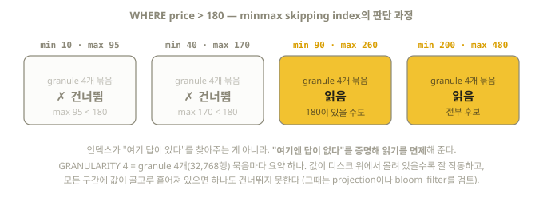

# 13장. Projection과 Data Skipping Index

> 시험 영역 4의 나머지 두 도구: "define a projection on a table",
> "define a Set or minmax skipping index". ORDER BY 하나로 못 잡는 쿼리를 구제한다.

## 13.1 도구 선택 지도

| 문제 상황 | 도구 |
|-----------|------|
| 다른 정렬 순서가 통째로 필요 (다른 쿼리 패턴) | **Projection** (또는 MV) |
| 같은 집계를 반복 계산 | **집계 Projection** (또는 집계 MV) |
| ORDER BY 뒤쪽/바깥 컬럼의 필터를 "부분적으로" 가속 | **Skipping Index** |
| 완전히 독립된 파이프라인·다른 엔진 필요 | Materialized View |

## 13.2 Projection — part 안에 숨은 대체 정렬본

Projection은 **각 part 내부에 함께 저장되는 또 하나의 (정렬이 다른) 데이터 사본**이다.
쿼리 옵티마이저가 원본과 projection 중 유리한 쪽을 자동 선택한다.

```sql
-- 원본은 (event_type, event_time) 정렬 — user_id 검색이 느리다
ALTER TABLE events
    ADD PROJECTION by_user (
        SELECT * ORDER BY user_id
    );

-- ⚠️ ADD는 "이후 삽입분"에만 적용. 기존 데이터는 MATERIALIZE 필수 (시험 함정)
ALTER TABLE events
    MATERIALIZE PROJECTION by_user
    SETTINGS mutations_sync = 1;    -- 완료까지 대기
```

확인 방법:

```sql
-- projection이 실제로 쓰였는지: EXPLAIN에 ReadFromMergeTree (proj명) 표시
EXPLAIN indexes = 1 SELECT count() FROM events WHERE user_id = 101;

-- 강제로 projection을 쓰게 해서 검증 (안 쓰이면 에러 발생)
SELECT count() FROM events WHERE user_id = 101
SETTINGS force_optimize_projection = 1;

-- 실행 이력에서 확인 (서버 모드): query_log의 projections 컬럼
SELECT query, projections FROM system.query_log
WHERE type = 'QueryFinish' AND notEmpty(projections);
```

저장 비용이 부담되면 **인덱스형 projection**(25.5+)이 대안이다 — 데이터 전체 대신
`_part_offset`(행 위치)만 저장해 원본에서 읽을 위치를 찾는 용도로만 쓴다:

```sql
ALTER TABLE events ADD PROJECTION user_idx (SELECT _part_offset ORDER BY user_id);
```

### 집계 Projection

```sql
ALTER TABLE events
    ADD PROJECTION daily_counts (
        SELECT toStartOfDay(event_time) AS day, event_type, count()
        GROUP BY day, event_type
    );
ALTER TABLE events MATERIALIZE PROJECTION daily_counts SETTINGS mutations_sync = 1;

-- 이후 이 모양의 쿼리는 미리 집계된 값을 읽는다
SELECT toStartOfDay(event_time) AS day, event_type, count()
FROM events GROUP BY day, event_type;
```

### Projection vs Materialized View

| | Projection | MV |
|--|-----------|-----|
| 저장 위치 | 원본 part 내부 (자동 동기) | 별도 테이블 |
| 일관성 | 원본과 항상 일치 (뮤테이션도 함께) | 별도 관리 (백필 등) |
| 쿼리 | **자동 선택** — 쿼리 바꿀 필요 없음 | 대상 테이블을 직접 조회 |
| 유연성 | 같은 데이터의 재배열/집계만 | 필터, 다른 엔진, TTL 등 자유 |
| 비용 | 저장 공간·INSERT 비용 증가 | 동일하지만 분리 관리 |

> 기억: "쿼리를 못 바꾸는 상황(BI 도구 등)이면 projection, 파이프라인을 만들려면 MV."

### Projection의 대가 (실측된 함정)

projection이 있는 테이블은 **lightweight DELETE가 기본적으로 거부된다**:

```text
Code: 344. DB::Exception: DELETE query is not allowed ...
lightweight_mutation_projection_mode is set to THROW.
```

해결: `ALTER TABLE t MODIFY SETTING lightweight_mutation_projection_mode = 'rebuild';`
(또는 'drop' — projection 폐기), 아니면 `ALTER TABLE ... DELETE`(뮤테이션)를 쓴다. (14장)

## 13.3 Data Skipping Index — granule 건너뛰기 보조 인덱스

primary index가 못 거르는 컬럼에 대해, **granule 묶음별 요약 정보**를 저장해 두고
"이 구간에는 답이 없다"를 판정해 건너뛴다. B-tree처럼 행을 찾아주는 게 아니라
**읽지 않아도 될 구간을 제외**해 주는 소극적 인덱스다.

```sql
-- 생성 문법 (테이블 생성 시)
CREATE TABLE logs (
    ts      DateTime,
    level   LowCardinality(String),
    user_id UInt32,
    message String,
    INDEX level_idx level    TYPE set(100)                GRANULARITY 4,
    INDEX uid_idx   user_id  TYPE minmax                  GRANULARITY 4,
    INDEX msg_idx   message  TYPE tokenbf_v1(30720, 3, 0) GRANULARITY 4
) ENGINE = MergeTree ORDER BY ts;

-- 기존 테이블에 추가 (시험 문형)
ALTER TABLE logs ADD INDEX level_idx level TYPE set(100) GRANULARITY 4;
ALTER TABLE logs MATERIALIZE INDEX level_idx SETTINGS mutations_sync = 1;  -- 기존 데이터 적용
```

`GRANULARITY 4` = granule 4개(= 32,768행) 묶음마다 요약 하나. (primary index의
index_granularity와 다른 개념이니 혼동 주의)

동작 방식을 minmax 인덱스로 그려보면 이렇다 — 포인트는 인덱스가 답을 "찾아주는" 것이
아니라, 요약만 보고 **"여기엔 답이 없다"가 증명되는 구간을 읽기에서 면제**해 준다는 것:



### 종류별 선택 기준 (시험은 set과 minmax를 명시)

| 타입 | 저장하는 요약 | 잘 맞는 경우 |
|------|---------------|--------------|
| `minmax` | 구간의 최솟값·최댓값 | ORDER BY와 **느슨하게 상관된** 숫자/시간 (예: 시간순 테이블의 다른 타임스탬프 컬럼, 단조 증가 ID) |
| `set(N)` | 구간의 고유값 집합 (최대 N개) | **구간별로 값 종류가 적은** 컬럼 (지역별로 몰려 있는 카테고리 등). N 초과 구간은 스킵 불가 |
| `bloom_filter([오탐률])` | 값 존재 여부 확률 필터 | 고카디널리티 등가 비교 (`= 'x'`, `IN`) |
| `tokenbf_v1(크기, 해시수, 시드)` | 토큰(단어) bloom filter | 로그 텍스트의 단어 검색 (`hasToken`) — ⚠️ deprecated |
| `ngrambf_v1(n, 크기, 해시수, 시드)` | n-gram bloom filter | 부분 문자열 LIKE '%...%' 검색 — ⚠️ deprecated |
| `text(tokenizer = ...)` | 전문(full-text) 역색인 | **26.2부터 정식(GA)** — 텍스트 검색의 현행 권장 |

> tokenbf/ngrambf는 여전히 동작하고 기존 자료·시험 문제에도 남아 있을 수 있지만,
> 공식 문서는 deprecated로 표기했다. 신규 설계의 텍스트 검색은 `text` 인덱스를 쓴다
> (26.8 실측 검증):
>
> ```sql
> ALTER TABLE logs ADD INDEX msg_idx message
>     TYPE text(tokenizer = splitByNonAlpha) GRANULARITY 4;
> ```

### 효과 확인

```sql
EXPLAIN indexes = 1
SELECT count() FROM logs WHERE user_id = 12345;
-- Indexes: 항목에 Skip 인덱스명과 Granules: x/y 가 표시된다

-- 인덱스 무시하고 비교하고 싶을 때
SELECT count() FROM logs WHERE user_id = 12345
SETTINGS use_skip_indexes = 0;
```

### 언제 효과가 없나 (중요)

skipping index는 **값이 디스크 위에서 지역적으로 몰려 있을 때만** 효과가 있다.
ORDER BY와 무관하게 골고루 흩어진 컬럼(예: 시간순 테이블의 무작위 user_id)에
set/minmax를 걸어도 모든 구간에 그 값이 존재해서 하나도 건너뛰지 못한다.
그런 경우는 bloom_filter 계열(등가 검색)이나 projection이 답이다.

## 13.4 결정 트리 (시험용 요약)

```text
쿼리가 ORDER BY 키로 필터하는가?
├─ 예 → 아무것도 추가할 필요 없음
└─ 아니오
   ├─ 그 쿼리가 핵심 패턴이고 자주 실행 → Projection (다른 정렬) 또는 MV
   ├─ 등가/IN 검색 + 고카디널리티 → bloom_filter 인덱스
   ├─ 숫자·시간 범위 + ORDER BY와 상관성 있음 → minmax 인덱스
   ├─ 구간별 값 종류가 적음 → set(N) 인덱스
   └─ 텍스트 검색 → tokenbf_v1(단어) / ngrambf_v1(부분 문자열)
```

## 이해도 체크

```quiz
Q: `ALTER TABLE ... ADD PROJECTION`을 실행한 직후, 기존 데이터에 대한 쿼리는?
1) 즉시 projection의 혜택을 받는다
2) 혜택이 없다 — MATERIALIZE PROJECTION으로 기존 part에 소급 적용해야 한다 *
3) 테이블이 잠긴다
E: ADD는 "이후 삽입분"에만 적용된다. 시험 단골 함정 — ADD INDEX도 마찬가지로 MATERIALIZE INDEX가 필요하다 (13.2~13.3절).
```

```quiz
Q: skipping index의 본질에 가장 가까운 설명은?
1) 조건에 맞는 행의 위치를 찾아준다 (B-tree처럼)
2) 구간 요약을 보고 "여기엔 답이 없다"가 증명되는 구간을 건너뛴다 *
3) 데이터를 재정렬한다
E: 답을 찾아주는 게 아니라 읽기를 면제해 주는 소극적 인덱스다. 값이 흩어져 있으면 하나도 못 건너뛴다 (13.3절).
```

```quiz
Q: 시험이 명시한 skipping index 두 종류는?
1) text와 bloom_filter
2) set과 minmax *
3) ngrambf와 tokenbf
E: 공식 시험 범위 문구가 "Set 또는 minmax skipping index 정의"다. minmax는 범위 상관 숫자, set(N)은 구간별 값 종류가 적은 컬럼 (13.3절).
```

```quiz
Q: 쿼리를 바꿀 수 없는 BI 도구 환경에서 다른 정렬이 필요하다면?
1) Materialized View
2) Projection — 옵티마이저가 자동 선택하므로 쿼리 수정 불필요 *
3) 테이블을 매일 재생성
E: projection은 원본 쿼리 그대로 두고 엔진이 유리한 쪽을 고른다. MV는 대상 테이블을 직접 조회해야 한다 (13.2절).
```
