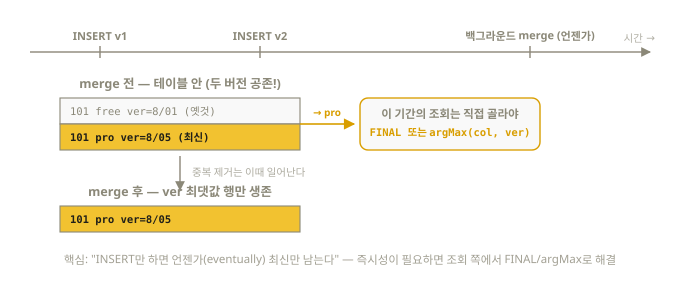
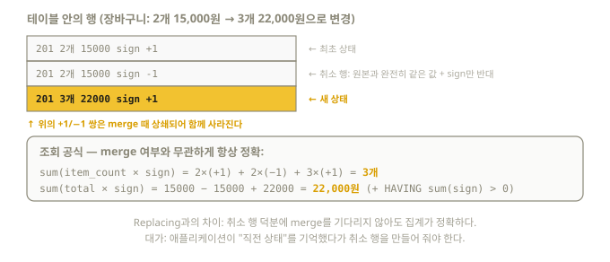

# 14장. 중복 제거와 뮤테이션 — 시험 영역 5

> OLAP DB인 ClickHouse에서 UPDATE/DELETE는 "예외적 작업"이다. 그래서 전용 패턴이
> 발달했고, 시험 영역 5가 통째로 여기에 할당돼 있다: lightweight delete,
> ReplacingMergeTree upsert, CollapsingMergeTree 업데이트.

## 14.1 왜 UPDATE가 어려운가 (5장 복습)

part는 불변(immutable)이다. 행 하나를 고치려면 그 행이 든 part 전체를 다시 써야 한다.
그래서 ClickHouse의 답은 세 갈래다:

1. **지우기**: lightweight DELETE / ALTER DELETE
2. **덮어쓰기(upsert)**: 새 버전을 INSERT하고, 조회·merge 때 최신만 남기기 — ReplacingMergeTree
3. **상쇄하기**: 취소 행(-1)과 새 행(+1)을 INSERT — CollapsingMergeTree

## 14.2 Lightweight DELETE — `DELETE FROM`

```sql
DELETE FROM events WHERE user_id = 104;
```

- 동작: 행을 즉시 지우는 게 아니라 **숨김 표시**(내부 `_row_exists` 마스크)만 한다.
  이후 SELECT에는 안 보이고, 실제 제거는 백그라운드 merge가 수행
- "lightweight(가벼운)"은 **표시 단계**가 가볍다는 뜻 — 대량으로 자주 쓰면 여전히 부담
- MergeTree 계열에서 동작. 자주 쓰는 삭제 패턴이 "오래된 데이터 정리"라면
  DELETE보다 **TTL이나 DROP PARTITION**이 정답이다 (훨씬 저렴)

⚠️ 실측된 함정 (13장 참조): **projection이 있는 테이블에서는 기본 설정상 거부된다.**

```sql
ALTER TABLE events MODIFY SETTING lightweight_mutation_projection_mode = 'rebuild';
DELETE FROM events WHERE user_id = 104;   -- 이제 동작
```

### Lightweight UPDATE (베타)

`UPDATE 테이블 SET ... WHERE ...` 문이 25.7에 도입됐고 2026년 8월 현재 공식 상태는
**베타**다. 패치 part(변경분만 담은 작은 part) 방식으로 동작하며, 전제조건이 있다 —
테이블에 두 설정을 켜야 한다 (26.8 실측 검증):

```sql
CREATE TABLE up (id UInt32, v String)
ENGINE = MergeTree ORDER BY id
SETTINGS enable_block_number_column = 1, enable_block_offset_column = 1;

UPDATE up SET v = 'new' WHERE id = 1;   -- 동작 확인
```

제약: PK/파티션 키 갱신 불가, 대량(테이블의 10% 초과) 갱신 비권장, 패치 part가
남아 있는 동안 skipping index·projection 미적용 + SELECT에 수 % 오버헤드.
시험 대비로는 아래의 전통 3종(ALTER UPDATE / Replacing / Collapsing)이 우선이다.

## 14.3 뮤테이션 — `ALTER TABLE ... DELETE / UPDATE`

무거운 정통 방식. **조건에 걸린 part 전체를 재작성**한다.

```sql
ALTER TABLE events DELETE WHERE user_id = 104;
ALTER TABLE events UPDATE url = '/renamed' WHERE url = '/old';

-- 기본은 비동기 실행. 완료를 기다리려면:
ALTER TABLE events DELETE WHERE user_id = 104
SETTINGS mutations_sync = 1;    -- 1: 현재 서버 완료 대기, 2: 전체 레플리카 대기

-- 진행 상황 확인: latest_fail_reason이 차 있으면 그 뮤테이션이 큐를 막고 있는 것
SELECT database, table, mutation_id, command, parts_to_do, latest_fail_reason
FROM system.mutations WHERE NOT is_done ORDER BY create_time;

-- 중단: 반드시 database/table로 범위를 좁혀라 (mutation_id는 테이블마다 겹친다!)
KILL MUTATION WHERE database = 'default' AND table = 'events'
                AND mutation_id = 'mutation_5.txt';
```

- ⚠️ **primary key와 파티션 키 계산에 쓰이는 컬럼은 UPDATE할 수 없다**
  (`PARTITION BY toYYYYMM(created_at)`이면 created_at도 불가)
- 뮤테이션은 스케줄일 뿐 즉시 반영이 아니다 — 시험에서 결과 검증 전에
  `mutations_sync = 1`을 붙이는 습관을 들여라
- 뮤테이션은 **생성 순서대로 처리**된다 — 앞 뮤테이션이 실패하면 뒤가 영원히
  대기한다 (lightweight DELETE도 내부적으로 뮤테이션이라 같은 큐에 막힌다)
- KILL은 되돌리기가 아니다 — 공식 문구: "이미 적용된 변경은 롤백되지 않는다."
  일부만 적용된 상태가 남을 수 있다

## 14.4 ReplacingMergeTree — upsert의 표준 ★★★

**같은 ORDER BY 키를 가진 행들 중 하나만 남기고 제거**하는 MergeTree.
"INSERT만으로 UPDATE 효과"를 내는 ClickHouse식 upsert다.

```sql
CREATE TABLE user_profiles (
    user_id    UInt32,
    email      String,
    plan       LowCardinality(String),
    updated_at DateTime
) ENGINE = ReplacingMergeTree(updated_at)   -- ver 컬럼: 최댓값 행이 승자
ORDER BY user_id;                           -- 이 키가 같으면 "중복"

-- 갱신 = 그냥 새 버전을 INSERT
INSERT INTO user_profiles VALUES (101, 'a@x.com', 'free', '2026-08-01 00:00:00');
INSERT INTO user_profiles VALUES (101, 'a@x.com', 'pro',  '2026-08-05 00:00:00');
```

- `ReplacingMergeTree(ver)` — ver(버전 컬럼) 최댓값 행이 남는다.
  생략하면 "마지막에 삽입된 행"이 남는데, 순서 보장이 약하므로 **ver 명시를 권장**
- ⚠️ **핵심 이해: 중복 제거는 백그라운드 merge 때 일어난다.**
  merge 전에는 두 행이 공존한다 — "언젠가(eventually)" 중복 제거

시간 순서로 그려보면 이 엔진의 성격이 분명해진다. "INSERT는 즉시, 정리는 나중에" —
그래서 정리가 되기 전의 조회는 스스로 최신을 골라야 한다:



### 조회 시점 중복 제거 — 두 가지 방법 (실측 검증)

```sql
-- 방법 1: FINAL — 읽으면서 즉석 병합. 간편하지만 대규모에선 비용 큼
SELECT * FROM user_profiles FINAL WHERE user_id = 101;

-- 방법 2: argMax — GROUP BY로 최신값 선택. 대규모에서 예측 가능
SELECT
    user_id,
    argMax(email, updated_at) AS email,   -- updated_at이 최대인 행의 email
    argMax(plan,  updated_at) AS plan,
    max(updated_at)           AS updated_at
FROM user_profiles
GROUP BY user_id;
```

둘 다 `plan = 'pro'`를 반환한다. FINAL은 23.12+의 범위 분할 최적화(병합이 필요 없는
구간과 필요한 구간을 나눠 처리) 덕에 과거만큼 느리지 않다 — 공식 벤치마크 기준 약
2.4배 개선. 추가로 `do_not_merge_across_partitions_select_final = 1`을 켜면 파티션을
서로 독립적으로 처리해 더 빨라지지만, ⚠️ **같은 키의 모든 버전이 반드시 같은
파티션에 들어간다는 보장이 있을 때만** 켜야 한다 (`PARTITION BY toYYYYMM(updated_at)`
처럼 버전마다 파티션이 바뀔 수 있는 키에서는 조용히 틀린 결과가 나온다).
초대형 테이블·고QPS 조회라면 argMax 패턴이 여전히 안전하다.

### 삭제 표시 — is_deleted (신형)

```sql
CREATE TABLE t (
    key UInt32, value String, ver UInt64, is_deleted UInt8
) ENGINE = ReplacingMergeTree(ver, is_deleted)   -- 두 번째 인자
ORDER BY key;

INSERT INTO t VALUES (1, 'hello', 1, 0);
INSERT INTO t VALUES (1, 'hello', 2, 1);   -- 삭제 표시 (tombstone)
SELECT * FROM t FINAL;                     -- 0행 — 삭제된 것으로 처리
```

⚠️ FINAL에서 안 보일 뿐 **디스크에서 지워진 것은 아니다** — 공식 문서 기준,
merge 후에도 기본적으로 삭제 표시 행(tombstone)이 최종 버전으로 보존된다.
물리 삭제까지 하려면 `allow_experimental_replacing_merge_with_cleanup = 1` 설정 후
`OPTIMIZE TABLE t FINAL CLEANUP`을 쓰는데, CLEANUP은 삭제 이력 자체를 지우므로
**더 오래된 버전의 행이 뒤늦게 도착하면 삭제된 행이 부활**하는 부작용이 있다.

## 14.5 CollapsingMergeTree — 취소·상쇄 방식 ★★

행 상태가 자주 바뀌고, **merge 전에도 정확한 집계**가 필요할 때 쓴다.
`sign Int8` 컬럼에 상태 행은 `+1`, 취소 행은 `-1`을 기록한다.

```sql
CREATE TABLE cart_state (
    user_id    UInt32,
    item_count UInt32,
    total      UInt32,
    sign       Int8
) ENGINE = CollapsingMergeTree(sign)
ORDER BY user_id;

-- 최초 상태: 장바구니 2개 15,000원
INSERT INTO cart_state VALUES (201, 2, 15000, 1);

-- 상태 변경: "이전 상태 취소" + "새 상태"를 한 번에 INSERT
INSERT INTO cart_state VALUES
    (201, 2, 15000, -1),   -- ⚠️ 취소 행은 원본과 값이 완전히 같아야 한다 (sign만 반대)
    (201, 3, 22000, 1);
```

가계부에서 잘못 적은 지출을 지우개로 지우는 대신 **"−15,000원"이라고 한 줄 더 적어
상쇄**하는 방식이다. 장부(part)는 불변이니 지울 수 없지만, 반대 부호를 더하면
합계는 항상 정확하다:



merge 때 같은 키의 +1/-1 쌍이 상쇄되어 사라진다. 조회는 **merge 여부와 무관하게
정확한** 다음 패턴으로:

```sql
SELECT
    user_id,
    sum(item_count * sign) AS item_count,   -- 취소 행이 음수로 빠짐
    sum(total * sign)      AS total
FROM cart_state
GROUP BY user_id
HAVING sum(sign) > 0;                        -- 완전히 취소된 키 제외
-- 201 | 3 | 22000  (실측)
```

- 애플리케이션이 **직전 상태를 알아야** 취소 행을 만들 수 있다 — 이것이 운영 부담
- INSERT 순서가 섞이면(취소가 먼저 도착) 정합이 깨질 수 있다 →
  그 경우 `VersionedCollapsingMergeTree(sign, version)`을 쓴다 (버전으로 순서 판정, 실측 검증)

## 14.6 INSERT 시점 중복 방지

같은 데이터 블록을 실수로 두 번 INSERT하면? **Replicated/Cloud 테이블은 최근 삽입
블록의 해시(기본 1만 개, 1시간)를 기억해 재삽입을 무시한다** — 재시도 시 정확히
같은 블록을 보내면 안전하다.

⚠️ **로컬 단일 노드의 일반 MergeTree는 사실상 꺼져 있다** —
`non_replicated_deduplication_window` 기본값이 0이기 때문이다. `clickhouse local`
실습에서 "재시도했더니 중복이 생겼다"면 이것이 원인이다. 켜려면:

```sql
CREATE TABLE t (...) ENGINE = MergeTree ORDER BY id
SETTINGS non_replicated_deduplication_window = 100;
```

임의 기준의 중복 방지는 `insert_deduplication_token`으로 한다. 단, **토큰이 내용
해시보다 우선**하므로 같은 토큰으로 다른 데이터를 보내면 **에러 없이 조용히
버려진다** — 토큰은 배치마다 고유하게(파일명+오프셋, Kafka의 topic-partition-offset,
배치 UUID) 만들어야 한다.

### OPTIMIZE TABLE ... FINAL — 최후의 수단

수동 merge로 중복을 즉시 정리할 수 있지만, 이 명령은 merge 크기 안전장치를 무시하고
파티션을 단일 거대 part로 합친다. 한번 만들어진 거대 part는 **이후 자동 merge에서
사실상 배제되어 그 파티션의 중복 제거가 멈춘다.** 공식 가이드: cron에 넣지 말 것,
"too many parts"의 해결책이 아님. 허용되는 용법은 더 이상 쓰기가 없는 닫힌
파티션의 1회성 정리뿐이다:

```sql
OPTIMIZE TABLE events PARTITION 202508 FINAL;
OPTIMIZE TABLE t FINAL SETTINGS optimize_throw_if_noop = 1;  -- 실제 merge 여부 확인
```

## 14.7 선택 가이드 (시험 최종 정리)

| 요구사항 | 정답 |
|----------|------|
| 오래된 데이터 정기 삭제 | TTL / DROP PARTITION |
| 가끔 소량 행 삭제 | lightweight DELETE (`DELETE FROM`) |
| 대량 일괄 수정/삭제 (드물게) | ALTER UPDATE / DELETE (뮤테이션) |
| 최신 상태만 유지 (upsert), 즉시성 불필요 | **ReplacingMergeTree** + FINAL/argMax |
| 컬럼별로 도착 시점이 다른 최신값 병합 (IoT 텔레메트리 등) | **CoalescingMergeTree** (25.6+) — 컬럼 단위로 최신 non-NULL 값 유지 |
| 빈번한 상태 변경 + merge 전에도 정확한 집계 | **CollapsingMergeTree** (sign 패턴) |
| 순서가 뒤섞일 수 있는 상태 변경 | VersionedCollapsingMergeTree |
| GDPR류 "이 사용자 데이터 전부 삭제" | 뮤테이션 (완전 삭제 보장) |

CoalescingMergeTree 예 (26.8 실측 — ReplacingMergeTree였다면 두 번째 INSERT에서
battery가 NULL로 덮였을 것):

```sql
CREATE TABLE ev_state (vin String, battery Nullable(UInt8), lat Nullable(Float64))
ENGINE = CoalescingMergeTree ORDER BY vin;

INSERT INTO ev_state VALUES ('V1', 80, NULL);
INSERT INTO ev_state (vin, lat) VALUES ('V1', 37.5);
SELECT * FROM ev_state FINAL;   -- V1 | 80 | 37.5  (battery 유지!)
```

## 이해도 체크

```quiz
Q: ReplacingMergeTree에 같은 키로 두 번 INSERT한 직후 SELECT하면?
1) 최신 행만 보인다
2) 두 행이 모두 보인다 — merge 전이므로 *
3) 에러가 난다
E: 중복 제거는 백그라운드 merge 때 일어난다. 즉시 최신만 보려면 FINAL 또는 argMax + GROUP BY (14.4절).
```

```quiz
Q: CollapsingMergeTree에서 상태를 변경하는 올바른 방법은?
1) UPDATE 문 실행
2) 이전 상태와 완전히 같은 값 + sign=-1 취소 행과 새 상태 +1 행을 INSERT *
3) 이전 행을 DELETE 후 INSERT
E: 취소 행은 원본과 값이 완전히 같아야 상쇄된다. 조회는 sum(값×sign) + HAVING sum(sign)>0 (14.5절).
```

```quiz
Q: `ALTER TABLE ... UPDATE`로 변경할 수 없는 컬럼은?
1) 아무 컬럼이나 가능
2) primary key와 파티션 키 계산에 쓰이는 컬럼 *
3) 문자열 컬럼
E: 정렬·파티션 구조가 깨지기 때문이다. PARTITION BY toYYYYMM(created_at)이면 created_at도 불가 (14.3절).
```

```quiz
Q: `OPTIMIZE TABLE ... FINAL`을 cron에 넣어 상시 실행하면 안 되는 이유는?
1) 문법이 자주 바뀌어서
2) 거대 단일 part가 만들어져 이후 자동 merge에서 배제되기 때문 *
3) 라이선스 위반이라서
E: merge 크기 안전장치를 무시하고 합치므로, 한 번 만들어진 거대 part는 그 파티션의 중복 제거를 멈추게 한다. 닫힌 파티션의 1회성 정리에만 (14.6절).
```

```quiz
Q: 로컬 단일 노드 MergeTree에서 같은 INSERT를 재시도했더니 중복이 생겼다. 이유는?
1) 버그다
2) 비복제 테이블은 non_replicated_deduplication_window 기본값이 0이라 dedup이 꺼져 있어서 *
3) 재시도가 원래 불가능해서
E: 블록 중복 제거는 Replicated/Cloud에서 기본 활성이고, 로컬 MergeTree는 설정을 켜야 한다 (14.6절).
```
