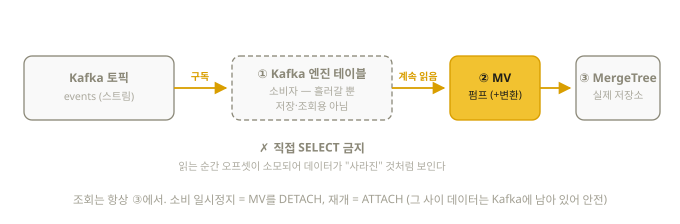

# 15장. 기타 테이블 엔진과 스트리밍 연동

> MergeTree 가족 외에도 쓰임새별 엔진이 있다. 각각 "언제 쓰는지" 한 단락씩만
> 알면 충분하고, Kafka 연동 패턴은 시험 언급 영역이므로 문형을 익혀두자.

## 15.1 보조 엔진 한눈에

| 엔진 | 용도 | 특징 |
|------|------|------|
| `Memory` | 실습·임시 데이터 | 메모리에만 저장, 재시작 시 소멸. 인덱스 없음 |
| `Log` / `StripeLog` / `TinyLog` | 소형 append 전용 | 인덱스·merge 없음. 100만 행 이하 참조 데이터, 개발용 |
| `Null` | 데이터 버리기 | INSERT를 받아서 버림. **MV의 입구**로 쓰는 트릭이 유명 (원본 저장 없이 MV만 채우기) |
| `CoalescingMergeTree` | 컬럼 단위 최신값 병합 (25.6+) | 같은 키의 컬럼별 최신 non-NULL 값을 유지 — 14장 참조 |
| `Set` | IN 절 전용 집합 | `WHERE x IN set_table` |
| `Join` | JOIN 전용 사전 로드 | 오른쪽 테이블을 상시 메모리에 |
| `Buffer` | 잦은 소량 INSERT 완충 | 메모리에 모았다가 목적지로 방출 (요즘은 async_insert가 대체) |
| `Distributed` | 샤딩 프록시 | 자체 저장 없음, 여러 샤드로 분배 (17장) |
| `MySQL` / `PostgreSQL` | 외부 DB 프록시 | 원격 테이블을 제자리에서 SELECT (ETL 없이 조회) |
| `S3` | S3 경로를 테이블로 고정 | s3() 함수의 상시 버전 |

```sql
-- 외부 DB 프록시 예: PostgreSQL 테이블을 ClickHouse에서 바로 읽기
CREATE TABLE pg_users (id UInt32, name String)
ENGINE = PostgreSQL('pg-host:5432', 'mydb', 'users', 'user', 'password');

-- S3 엔진: 경로를 테이블로 등록해 두고 반복 사용
CREATE TABLE s3_events (ts DateTime, user_id UInt32)
ENGINE = S3('https://bucket.s3.amazonaws.com/events/*.parquet', 'Parquet');
```

## 15.2 Kafka 연동 — 표준 3단 패턴

Kafka 엔진 테이블은 **토픽을 구독하는 소비자**다. 단, Kafka 테이블 자체는
"흘러가는 스트림"이라 저장·조회용이 아니다. 반드시 **MV로 퍼 나르는 3단 구조**로 쓴다:



```sql
-- ① Kafka 소비자 테이블
CREATE TABLE kafka_events_queue (
    ts      DateTime,
    user_id UInt32,
    action  String
) ENGINE = Kafka
SETTINGS
    kafka_broker_list  = 'kafka:9092',
    kafka_topic_list   = 'events',
    kafka_group_name   = 'clickhouse_consumer',
    kafka_format       = 'JSONEachRow';

-- ② 실제 저장 테이블
CREATE TABLE events (
    ts      DateTime,
    user_id UInt32,
    action  LowCardinality(String)
) ENGINE = MergeTree
ORDER BY (action, ts);

-- ③ 펌프 역할의 MV (여기서 변환도 가능)
CREATE MATERIALIZED VIEW events_pump TO events AS
SELECT ts, user_id, action
FROM kafka_events_queue;
```

- Kafka 테이블을 직접 SELECT하면 오프셋이 소비돼 버리므로 **직접 조회 금지**가 원칙
- 소비 중단/재개: `DETACH TABLE events_pump;` / `ATTACH TABLE events_pump;`
- ClickHouse Cloud에서는 Kafka 엔진 대신 **ClickPipes**(관리형 수집 파이프라인)가
  권장된다 — UI에서 토픽을 연결하면 끝

## 15.3 Null 엔진 + MV 트릭 (실무 빈출)

"원본은 저장하지 않고 집계만 저장하고 싶다":

```sql
CREATE TABLE raw_ingest (ts DateTime, user_id UInt32, amount UInt64)
ENGINE = Null;                        -- 저장 안 함

CREATE TABLE daily_agg (
    day Date,
    total SimpleAggregateFunction(sum, UInt64)
) ENGINE = AggregatingMergeTree ORDER BY day;

CREATE MATERIALIZED VIEW agg_mv TO daily_agg AS
SELECT toDate(ts) AS day, sum(amount) AS total
FROM raw_ingest GROUP BY day;

-- raw_ingest에 INSERT하면: 원본은 버려지고 집계만 daily_agg에 쌓인다
INSERT INTO raw_ingest VALUES (now(), 1, 100);
```

MV가 "INSERT 스트림에 붙는 트리거"(12장)임을 이해했다면 자연스러운 응용이다.
