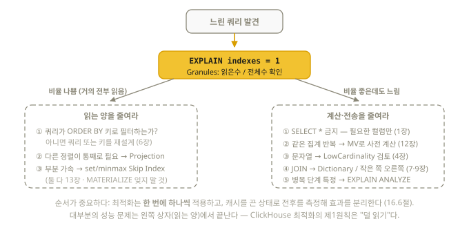

# 16장. 쿼리 성능 분석 — EXPLAIN과 system 테이블

> 최적화 도구(12~14장)를 "언제, 왜" 쓰는지 판단하려면 측정부터 해야 한다.
> 이 장은 시험에서 내 답을 검증하는 도구이자, 실무 튜닝의 출발점이다.

## 16.1 쿼리 실행 통계 읽기

clickhouse-client로 쿼리를 실행하면 마지막 줄에 통계가 나온다:

```text
5 rows in set. Elapsed: 0.012 sec. Processed 1.00 million rows, 8.00 MB
(83.3 million rows/s, 666.4 MB/s)
```

- **Processed rows가 결과 행 수보다 터무니없이 크면** → 인덱스가 안 먹고 있다는 신호
- 순수 쿼리 시간만 재려면 출력 비용 제거: `SELECT ... FORMAT Null`

## 16.2 EXPLAIN 가족

```sql
EXPLAIN SELECT ...;              -- 논리 실행 계획 (기본 = EXPLAIN PLAN)
EXPLAIN indexes = 1 SELECT ...;  -- ★ 인덱스 사용 내역 (아래)
EXPLAIN ANALYZE SELECT ...;      -- ★ 실제 실행 + 단계별 실측치 (26.7+, 아래)
EXPLAIN PIPELINE SELECT ...;     -- 물리 파이프라인 (스레드 구성)
EXPLAIN ESTIMATE SELECT ...;     -- 읽을 행/granule 추정치
EXPLAIN SYNTAX SELECT ...;       -- 최적화 후 재작성된 쿼리
EXPLAIN AST SELECT ...;          -- 파싱 트리
```

> 참고: 26.7부터 EXPLAIN 기본 출력이 보기 좋은(pretty) 형식으로 바뀌었다.
> 구버전 자료의 밋밋한 출력과 모양이 달라도 내용은 같다.

### EXPLAIN indexes = 1 — 시험에서 가장 중요한 하나 (26.8 실측)

```sql
EXPLAIN indexes = 1
SELECT count() FROM hits WHERE user_id = 42;
```

```text
ReadFromMergeTree (default.hits)
  Indexes:
    PrimaryKey
      Keys: user_id
      Condition: (user_id in [42, 42])
      Parts: 1/1
      Granules: 1/12        ← 핵심 지표!
      Search Algorithm: binary search
```

읽는 법:

| 항목 | 의미 |
|------|------|
| `Granules: 1/12` | 전체 12개 granule 중 1개만 읽음 — **인덱스가 잘 작동** |
| `Granules: 12/12` | 풀스캔 — ORDER BY 키로 필터하지 않았거나 키 설계가 잘못됨 |
| `Parts: x/y` | part 수준에서 걸러진 정도 (파티션 pruning 포함) |
| Skip 인덱스 항목 | 13장의 skipping index가 쓰였는지, 얼마나 걸렀는지 |
| `ReadFromMergeTree (proj명)` | projection이 선택되었다는 표시 |

### EXPLAIN ANALYZE — 실측치가 붙는 실행 계획 (26.7+, 26.8 검증)

계획만 보여주는 EXPLAIN과 달리 **쿼리를 실제로 실행하고**(결과 행은 버림)
각 단계에 시간·행 수·병렬도를 주석으로 붙인다:

```sql
EXPLAIN ANALYZE SELECT type, count() FROM t GROUP BY type;
```

```text
Query summary:
  Time:        3.57 ms (planning 839.42 us · execution 2.73 ms)
  Read:        1.00 million rows, 1.00 MB
  Peak memory: 184.54 KiB
...
└──Aggregating
   │  I/O: rows 1.00 million → 3 (0.00%)
   │    Stage (partial aggregation): time 1.08 ms (39.5%) · parallelism 7.38/12
...
```

- 각 단계의 `time (%)`로 **어느 단계가 병목인지** 바로 보인다
- `parallelism 7.38/12` = 12스레드 중 평균 7.38개 활용. `0.9/12`처럼 낮으면
  그 단계가 직렬 병목이라는 뜻
- `EXPLAIN ANALYZE processors = 1`을 주면 프로세서별 시간 분포까지 출력

## 16.3 system 테이블 — ClickHouse의 계기판

ClickHouse는 자기 상태를 전부 `system` 데이터베이스의 테이블로 노출한다.
**"SQL로 서버를 들여다본다"** — 이 발상에 익숙해지면 운영이 쉬워진다.

### 자주 쓰는 것들 (전부 26.8 검증)

```sql
-- 테이블 크기·행 수·part 수
SELECT count() AS parts, sum(rows) AS total_rows,
       formatReadableSize(sum(bytes_on_disk)) AS disk
FROM system.parts
WHERE table = 'big' AND active;

-- 컬럼별 압축률 (어느 컬럼이 디스크를 먹나)
SELECT column,
       formatReadableSize(sum(column_data_compressed_bytes))   AS compressed,
       formatReadableSize(sum(column_data_uncompressed_bytes)) AS uncompressed,
       round(sum(column_data_uncompressed_bytes) / sum(column_data_compressed_bytes), 1) AS ratio
FROM system.parts_columns
WHERE table = 'big' AND active
GROUP BY column
ORDER BY sum(column_data_compressed_bytes) DESC;

-- 지금 실행 중인 쿼리
SELECT query_id, user, elapsed, formatReadableSize(memory_usage) AS mem, query
FROM system.processes;

-- 느린 쿼리 찾기 (query_log는 서버 모드에서 기본 활성)
SYSTEM FLUSH LOGS;   -- ① query_log는 버퍼링됨 — 방금 쿼리를 보려면 먼저 플러시
SELECT
    event_time, query_duration_ms,
    read_rows, formatReadableSize(read_bytes) AS read,
    formatReadableSize(memory_usage) AS mem,
    substring(query, 1, 80) AS q
FROM system.query_log
WHERE type = 'QueryFinish'
  AND is_initial_query = 1   -- ② 서브쿼리/분산 하위 쿼리 행 제외 (공식 권장 상시 조건)
ORDER BY query_duration_ms DESC
LIMIT 10;

-- 뮤테이션 진행 상황 (14장)
SELECT * FROM system.mutations WHERE NOT is_done;

-- 진행 중인 merge
SELECT * FROM system.merges;
```

| 테이블 | 내용 |
|--------|------|
| `system.tables` / `system.columns` | 스키마 카탈로그 |
| `system.parts` / `system.parts_columns` | part·컬럼 물리 상태 (크기·압축) |
| `system.query_log` | 쿼리 이력 (튜닝의 금광) |
| `system.processes` | 실행 중 쿼리 |
| `system.mutations` / `system.merges` | 백그라운드 작업 |
| `system.settings` / `system.merge_tree_settings` | 현재 설정값 + 설명 |
| `system.dictionaries` | 사전 상태 (7장) |
| `system.replicas` / `system.clusters` | 복제·클러스터 상태 (17장) |
| `system.functions` | 함수 목록 (이름 검색용) |

## 16.4 설정(settings) 다루기

```sql
-- 세션 전체에 적용
SET max_threads = 8;

-- 쿼리 하나에만 적용 (시험에서 애용하라)
SELECT count() FROM big_table
SETTINGS max_threads = 4, max_memory_usage = 10000000000;

-- 현재 값과 설명 확인
SELECT name, value, description FROM system.settings WHERE name = 'max_threads';
SELECT getSetting('max_threads');
```

자주 만나는 설정:

| 설정 | 의미 |
|------|------|
| `max_threads` | 쿼리 병렬 스레드 수 (기본: 코어 수) |
| `max_memory_usage` | 쿼리당 메모리 한도 |
| `max_execution_time` | 쿼리 시간 제한(초) |
| `join_use_nulls` | JOIN 미매칭을 기본값 대신 NULL로 |
| `mutations_sync` | 뮤테이션 완료 대기 (14장) |
| `async_insert` | 비동기 삽입 (8장) |
| `use_skip_indexes` | skipping index 사용 여부 (비교 실험용) |
| `force_optimize_projection` | projection 강제 (검증용, 13장) |

## 16.5 최적화 사고 순서 (공식 best practice 요약)

느린 쿼리를 만나면 이 순서로 점검한다:



1. **ORDER BY 키로 필터하고 있는가?** → `EXPLAIN indexes=1`에서 Granules 비율 확인.
   아니라면 쿼리를 키에 맞추거나, 키를 재설계하거나, projection(13장)
2. **필요한 컬럼만 SELECT하는가?** `SELECT *`는 컬럼 지향의 이점을 버리는 행위
3. **같은 집계를 반복 계산하는가?** → Materialized View(12장)로 사전 계산
4. **문자열 컬럼이 저카디널리티인가?** → LowCardinality(4장)
5. **JOIN이 큰가?** → 작은 테이블을 오른쪽에, 참조 조회는 Dictionary(7장)
6. **PREWHERE 활용** — MergeTree는 WHERE 조건 일부를 자동으로 PREWHERE로 옮겨
   "조건 컬럼 먼저 읽고 통과한 granule만 나머지 컬럼을 읽는" 2단계 필터를 한다.
   대부분 자동이므로 건드릴 일은 없지만, EXPLAIN에서 보이면 그 의미를 알아야 한다
7. **part가 너무 많지 않은가?** → 배치 삽입(8장), 파티션 재설계(5장)

## 16.6 벤치마크 습관

공식 권고: **캐시를 실제로 끄고** 재라 (여러 번 실행하면 warm 캐시 상태를 재는 것이다).
그리고 **최적화는 한 번에 하나씩** 적용해야 효과를 분리할 수 있다.

```sql
-- 캐시 영향 제거
SET enable_filesystem_cache = 0;
SYSTEM DROP MARK CACHE;
SYSTEM DROP UNCOMPRESSED CACHE;

-- 출력 비용 제거하고 순수 실행만 측정
SELECT count() FROM big WHERE tag = 'web' FORMAT Null;

-- 두 방식 비교: 설정으로 끄고 켜며 Processed rows 비교
SELECT count() FROM logs WHERE level = 'ERROR' SETTINGS use_skip_indexes = 0;
SELECT count() FROM logs WHERE level = 'ERROR' SETTINGS use_skip_indexes = 1;
```

시험에서도 과제를 풀고 나서 `EXPLAIN indexes = 1`로 **의도한 인덱스/projection이
실제로 쓰이는지 확인**하는 습관이 점수를 지킨다.

## 이해도 체크

```quiz
Q: `EXPLAIN indexes = 1` 출력에서 최적화 판단의 핵심 지표는?
1) 쿼리 길이
2) Granules: 읽은수/전체수 비율 *
3) Keys 목록의 개수
E: 이 비율이 인덱스가 얼마나 건너뛰었는지를 보여준다. 거의 같으면 풀스캔 — 읽는 양을 줄이는 도구(키·projection·skip index)를 검토한다 (16.2절).
```

```quiz
Q: EXPLAIN ANALYZE가 일반 EXPLAIN과 다른 점은?
1) 더 짧게 출력한다
2) 쿼리를 실제로 실행해 단계별 시간·병렬도 실측치를 붙인다 *
3) 실행 계획을 수정해 준다
E: 26.7+ 신기능. parallelism 0.9/12처럼 낮은 값이 보이는 단계가 직렬 병목이다 (16.2절).
```

```quiz
Q: 방금 실행한 쿼리가 system.query_log에 안 보인다. 첫 번째로 할 일은?
1) 서버 재시작
2) SYSTEM FLUSH LOGS 실행 *
3) 쿼리 재실행
E: query_log는 버퍼링된다. 플러시 후에는 is_initial_query = 1 조건도 함께 (서브쿼리 행 제외) — 공식 권장 상시 조건이다 (16.3절).
```

```quiz
Q: 두 가지 최적화의 효과를 비교 측정하는 올바른 방법은?
1) 여러 번 실행해 warm 캐시 상태로 평균
2) 캐시를 끄고(enable_filesystem_cache=0 등), 최적화를 한 번에 하나씩 적용 *
3) 프로덕션에서 바로 A/B 테스트
E: 반복 실행은 캐시 상태를 재는 것이다. 공식 권고는 캐시를 실제로 끄고, 변경을 하나씩 적용해 효과를 분리하는 것 (16.6절).
```
