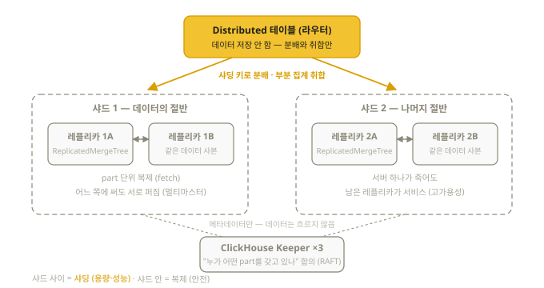

# 17장. 복제와 샤딩 — 한 대를 넘어설 때

> 공식 시험 목표 5개 영역에 복제·샤딩은 **포함되지 않는다** — 이 장은 실무 운영의
> 기초이자, 일부 시험 준비 자료에 언급되는 배경지식이다. 시험이 급하면 건너뛰고
> 나중에 돌아와도 된다. 개념 → 문법 → 배포 형태 순으로 정리한다.

## 17.1 두 가지 확장 축

| | 복제 (Replication) | 샤딩 (Sharding) |
|--|--------------------|-----------------|
| 무엇 | **같은 데이터**를 여러 서버에 복사 | 데이터를 **나눠서** 여러 서버에 분산 |
| 왜 | 고가용성(서버 죽어도 서비스), 읽기 분산 | 한 대에 안 담기는 용량, 쓰기/쿼리 분산 |
| 도구 | ReplicatedMergeTree + Keeper | Distributed 엔진 + 클러스터 설정 |

보통 "N개 샤드 × 샤드당 M개 레플리카" 격자로 조합한다. 전형적인 "2샤드 × 2레플리카"
클러스터의 전체 그림을 먼저 눈에 넣고 각 부품을 배우자 — 이 장의 나머지는 이 그림의
구성 요소를 하나씩 설명하는 것이다:



## 17.2 ClickHouse Keeper — 조정자

레플리카들은 "누가 어떤 part를 갖고 있는지"에 합의해야 한다. 이 조정(coordination)을
담당하는 것이 **ClickHouse Keeper**다.

- 과거에는 Apache ZooKeeper를 썼다 — Keeper는 ClickHouse 팀이 만든 대체품으로,
  **ZooKeeper 클라이언트 프로토콜만 호환**한다 (내부 합의 알고리즘은 ZAB가 아니라 **RAFT**,
  데이터 포맷도 달라 마이그레이션에는 `clickhouse-keeper-converter`가 필요).
  **현재 표준은 Keeper**이며 ZooKeeper는 레거시
- 보통 3노드 홀수 구성 (과반 합의)
- Keeper는 데이터를 저장하지 않는다 — 복제 메타데이터(part 목록, 복제 로그)만 다룬다.
  참고로 ReplicatedMergeTree는 멀티마스터라 여러 레플리카가 동시에 리더일 수 있다

## 17.3 ReplicatedMergeTree

MergeTree 가족 전체에 `Replicated` 접두사 버전이 있다
(ReplicatedMergeTree, ReplicatedReplacingMergeTree, ...).

```sql
CREATE TABLE events ON CLUSTER my_cluster (
    ts      DateTime,
    user_id UInt32,
    action  String
) ENGINE = ReplicatedMergeTree(
    '/clickhouse/tables/{shard}/events',   -- Keeper 상의 경로 (테이블 식별자)
    '{replica}'                            -- 이 서버의 레플리카 이름
)
ORDER BY (action, ts);
```

- `{shard}`, `{replica}`는 각 서버 설정(config의 macros)에서 치환되는 **매크로** —
  같은 DDL을 모든 서버에서 실행해도 서버마다 올바른 값이 들어간다
- `ON CLUSTER my_cluster`: DDL을 클러스터 전체 노드에서 한 번에 실행
- 인자 생략(`ENGINE = ReplicatedMergeTree`)은 서버 config에 `default_replica_path` /
  `default_replica_name`이 설정돼 있을 때만 동작한다 (Cloud는 자동, OSS는 설정 필요):
  ```xml
  <default_replica_path>/clickhouse/tables/{shard}/{database}/{table}</default_replica_path>
  <default_replica_name>{replica}</default_replica_name>
  ```
- 복제는 **part 단위**로 일어난다: 한 레플리카에 INSERT → part 생성 → Keeper에 등록 →
  다른 레플리카들이 그 part를 가져감(fetch). 어떤 레플리카에 써도 전체에 퍼진다
- 상태 진단 — 봐야 할 컬럼이 정해져 있다:
  ```sql
  SELECT database, table, is_readonly, is_session_expired, absolute_delay,
         queue_size, inserts_in_queue, log_max_index - log_pointer AS log_gap,
         total_replicas, active_replicas, zookeeper_exception
  FROM system.replicas
  WHERE is_readonly OR is_session_expired OR absolute_delay > 60
     OR active_replicas < total_replicas OR notEmpty(zookeeper_exception)
  FORMAT Vertical;
  -- log_gap이 크게 벌어져 있으면 그 레플리카가 뒤처졌다는 신호
  ```

## 17.4 Distributed 엔진 — 샤딩의 창구

Distributed 테이블은 데이터를 저장하지 않는 **라우터**다.

```sql
-- 각 샤드에 실제(local) 테이블이 있고
CREATE TABLE events_local ON CLUSTER my_cluster (...)
ENGINE = ReplicatedMergeTree(...) ORDER BY ...;

-- 그 위에 분산 창구를 만든다
CREATE TABLE events_all ON CLUSTER my_cluster AS events_local
ENGINE = Distributed(
    my_cluster,          -- 클러스터 이름 (config의 remote_servers에 정의)
    default,             -- 대상 DB
    events_local,        -- 대상 테이블
    rand()               -- 샤딩 키 (어느 샤드로 보낼지; cityHash64(user_id) 등)
);

-- 조회: 모든 샤드에 뿌려서 부분 결과를 모아온다
SELECT action, count() FROM events_all GROUP BY action;

-- 클러스터 정의 확인
SELECT cluster, shard_num, replica_num, host_name FROM system.clusters;
```

- INSERT를 Distributed에 하면 샤딩 키에 따라 각 샤드로 분배된다
  (로컬 테이블에 직접 넣는 운영 방식도 흔하다)
- ⚠️ 로컬 테이블이 ReplicatedMergeTree라면 클러스터 설정에서 반드시
  `<internal_replication>true</internal_replication>` — false면 Distributed가 모든
  레플리카에 직접 쓰는 동시에 Replicated 복제도 일어나 **데이터가 이중 삽입**된다
- 분산 쿼리 동작: 각 샤드가 **자기 데이터로 부분 집계** → 개시 노드가 병합.
  GROUP BY가 자연스럽게 분산되는 구조다

## 17.5 배포 형태 세 가지

### ① 셀프 호스팅 (직접 설치)

config.xml에 remote_servers(클러스터), macros, Keeper 연결을 직접 구성한다.
학습 순서상 마지막에 도전할 영역.

### ② Kubernetes + 오퍼레이터

공식 ClickHouse 오퍼레이터의 매니페스트 예 (이 저장소의 `clickhouse_values.yaml`이
정확히 이 형태다):

```yaml
apiVersion: clickhouse.com/v1alpha1
kind: KeeperCluster            # Keeper 3대
metadata: { name: my-keepers, namespace: clickhouse }
spec:
  replicas: 3
  ...
---
apiVersion: clickhouse.com/v1alpha1
kind: ClickHouseCluster        # ClickHouse 2 레플리카
metadata: { name: my-clickhouse-cluster, namespace: clickhouse }
spec:
  replicas: 2
  keeperClusterRef: { name: my-keepers }
```

오퍼레이터가 config·macros·복제 설정을 자동 생성한다. (Altinity 오퍼레이터라는
서드파티 대안도 널리 쓰인다.)

### ③ ClickHouse Cloud

- 복제·샤딩·Keeper가 **전부 자동/투명** — 사용자는 그냥 `CREATE TABLE ... ENGINE = MergeTree`
  라고 쓰면 내부적으로 **SharedMergeTree**(오브젝트 스토리지 공유 + 컴퓨트 분리 엔진)로 동작한다
- 스토리지(S3 등 오브젝트 스토리지)와 컴퓨트가 분리되어 노드 증설이 데이터 재배치 없이 즉시
- 시험 대비 관점: Cloud 콘솔 실습이 가장 쉽게 "진짜 클러스터" 경험을 준다 (2장)

## 17.6 접근 제어 기초 (실무 최소한)

```sql
CREATE USER analyst IDENTIFIED BY 'strong_password';
CREATE ROLE readonly;
GRANT SELECT ON default.* TO readonly;
GRANT readonly TO analyst;

-- 행 단위 정책
CREATE ROW POLICY kr_only ON events FOR SELECT USING country = 'KR' TO analyst;
-- ⚠️ 함정: 행 정책이 하나라도 생기는 순간, 정책 대상이 아닌 사용자는 그 테이블에서
-- 행을 하나도 못 보게 된다. 관리자용 보완 정책이 사실상 필수:
CREATE ROW POLICY admin_all ON events USING 1 TO admin_user;
-- 또한 Distributed 테이블에는 원격의 로컬 테이블에 정책을 걸어야 한다

-- 확인
SHOW GRANTS FOR analyst;
```

## 17.7 백업 한 줄 상식

```sql
BACKUP TABLE events TO Disk('backups', 'events_2026_08_16.zip');
RESTORE TABLE events FROM Disk('backups', 'events_2026_08_16.zip');
-- S3 대상: BACKUP TABLE events TO S3('https://bucket.s3...', 'KEY', 'SECRET');
```

파티션 단위 백업/복원, 증분 백업도 지원한다. Cloud는 자동 백업 제공.

## 이해도 체크

```quiz
Q: 복제(replication)와 샤딩(sharding)의 차이는?
1) 같은 말이다
2) 복제는 같은 데이터의 사본(안전), 샤딩은 데이터 분할(용량·성능) *
3) 샤딩이 복제의 구버전이다
E: 복제는 서버 장애 대비, 샤딩은 한 대에 안 담기는 규모 대응이다. 보통 "N샤드 × M레플리카"로 조합한다 (17.1절).
```

```quiz
Q: ClickHouse Keeper의 역할은?
1) 데이터를 저장하는 백업 서버
2) 복제 메타데이터(part 목록 등)의 합의·조정 *
3) 쿼리 속도 향상 캐시
E: Keeper는 데이터가 아니라 "누가 어떤 part를 갖고 있나"의 합의만 담당한다 (RAFT). ZooKeeper의 클라이언트 프로토콜 호환 대체품이다 (17.2절).
```

```quiz
Q: Distributed 테이블의 정체는?
1) 데이터를 나눠 저장하는 특수 MergeTree
2) 저장 없이 샤드로 분배·취합만 하는 라우터 *
3) 백업 전용 엔진
E: 자체 저장이 없다. INSERT는 샤딩 키로 분배하고, SELECT는 각 샤드의 부분 집계를 모아 병합한다 (17.4절).
```

```quiz
Q: 로컬 테이블이 ReplicatedMergeTree인데 클러스터 설정의 internal_replication이 false라면?
1) 아무 문제 없다
2) Distributed와 Replicated가 각각 복제해 데이터가 이중 삽입된다 *
3) 복제가 안 된다
E: Replicated를 쓸 때는 반드시 internal_replication=true — Distributed는 샤드당 한 레플리카에만 쓰고 복제는 엔진에 맡긴다 (17.4절).
```
