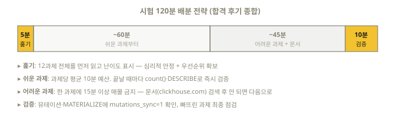

# 18장. 시험 준비 전략 — 합격자들의 방법론

> 0장의 시험 정보에 이어, "어떻게 준비하고 어떻게 치를 것인가"를 다룬다.
> 공식 블로그의 합격 후기(OpenMeter 팀)와 공식 안내를 근거로 정리했다.

## 18.1 공식 무료 교육 활용 — 최우선 순위

시험 주관사가 직접 말한다: **"시험은 교육 과정에서 배운 내용에 크게 의존한다.
데이터셋은 다르지만 과제 유형이 실습(lab)과 매우 유사하다."**

- **Real-time Analytics with ClickHouse** (무료, [clickhouse.com/learn](https://clickhouse.com/learn))
  - 현행 학습 경로: **10개 모듈 / 3레벨, 총 약 10시간** (구 12모듈 코스는 deprecated).
    레벨 1(소개·아키텍처·삽입)을 마치면 *Database Associate*, 레벨 2(모델링·분석·
    조인·삭제와 수정)까지 *Database Professional* 중간 배지, 레벨 3(쿼리 가속·
    샤딩과 복제·데이터 관리)이 시험 직결 심화다
  - 강사 주도(라이브)도 무료 — 일정은 공식 Live Events 페이지
- **공식 lab 솔루션 저장소**: [github.com/ClickHouse/clickhouse-academy](https://github.com/ClickHouse/clickhouse-academy)
  — 교육 과정 실습의 정답지가 공개되어 있다. 자격증 대비 우선순위:
  `realtime-analytics/` → `developer/` → `query-optimization/` → `hands-on-labs/`
- ClickHouse Academy의 다른 무료 자료 중 **Query Optimization Workshop(3시간)**은
  시험 영역 4와 정면으로 겹친다 — 강력 추천
- 합격자 조언:
  - 몰아서 끝내지 말고 **모듈 사이에 소화 시간**을 둘 것 (특히 다른 DB와 다른 개념들)
  - **실습(lab)의 자기 솔루션을 시험 직전에 다시 풀어볼 것** — 시험 유형과 직결
  - 개념 학습은 Cloud SQL 콘솔이 편리하지만, **실제 시험 환경은 터미널의
    clickhouse-client다** — 마지막 1~2주는 반드시 CLI로 연습할 것 (2장의 단축키 참고)

이 바이블과의 관계: 이 책 4~16장이 공식 교육의 범위를 전부 커버하고 검증된 예제를
더한다. **책으로 개념 → 공식 lab으로 실습 → 19장 모의고사로 마무리** 순서를 권한다.

## 18.2 문서 내비게이션 훈련 — 숨은 당락 요소

시험 중 [공식 문서](https://clickhouse.com/docs) 열람이 허용된다. 합격자 왈:
**"함수 정의를 통째로 외우는 게 특기가 아니라면, 문서를 빠르게 찾는 능력을 길러라.
특정 함수를 찾을 땐 검색보다 카테고리 위치를 아는 게 빠를 때가 많다."**

시험 전에 이 위치들을 손에 익혀두라 (2026년 개편 후 문서는 **Get started / Guides /
Reference / Our solutions** 4개 최상위 아래로 통합됐다 — 아래는 그 기준):

| 자주 찾게 되는 것 | 문서 위치 (Reference 하위) |
|-------------------|-----------|
| 일반 함수 (문자열/날짜) | Reference → Functions → Regular Functions |
| 집계 함수 | Reference → Functions → Aggregate Functions |
| 윈도우 함수 / 테이블 함수 | Reference → Functions → Window / Table Functions |
| CREATE TABLE / MergeTree 옵션 | Reference → Table Engines → MergeTree Family |
| ReplacingMergeTree 등 특수 엔진 | 〃 → 각 엔진 |
| Materialized View | Reference → Statements → CREATE → VIEW (+ Guides의 MV 가이드) |
| Dictionary | Reference → Dictionaries |
| 포맷 목록 | Reference → Formats |
| 설정 검색 | Reference → Settings |

로컬 서버를 띄웠다면 `http://localhost:8123/docs`(내장 오프라인 문서, 2장)로
**설치 버전과 일치하는** 문서를 검색하는 연습도 좋다.

훈련법: 이 책을 공부하다 막힐 때마다 **일부러 문서에서 해당 페이지를 찾아가는**
습관을 들여라. 그 왕복 자체가 시험 준비다.

## 18.3 실전 데이터셋으로 훈련

공식 [Example Datasets](https://clickhouse.com/docs/getting-started/example-datasets)
중 학습 가성비가 좋은 것들. (아래 UK 데이터셋 URL은 26.8에서 로드 검증됨)

### UK 부동산 가격 (27,450,499행 — 공식 교육에도 등장)

```sql
CREATE TABLE uk_price_paid (
    price     UInt32,
    date      Date,
    postcode1 LowCardinality(String),
    postcode2 LowCardinality(String),
    type      Enum8('terraced'=1,'semi-detached'=2,'detached'=3,'flat'=4,'other'=0),
    is_new    UInt8,
    duration  Enum8('freehold'=1,'leasehold'=2,'unknown'=0),
    addr1     String,
    addr2     String,
    street    LowCardinality(String),
    locality  LowCardinality(String),
    town      LowCardinality(String),
    district  LowCardinality(String),
    county    LowCardinality(String)
) ENGINE = MergeTree
ORDER BY (postcode1, postcode2, addr1, addr2);

-- 빠른 로드: 공개 S3 Parquet (검증됨: house_0.parquet 하나만 277만 행)
INSERT INTO uk_price_paid
SELECT * FROM s3('https://datasets-documentation.s3.eu-west-3.amazonaws.com/house_parquet/house_{0..9}.parquet', NOSIGN);
```

**"삽입 중 변환" 연습용**으로는 공식 문서의 원본 CSV 로드 버전이 훨씬 좋다 —
시험 영역 2의 기술이 전부 들어 있다 (날짜 파싱, splitByChar, transform 매핑, 조건 변환):

```sql
INSERT INTO uk_price_paid
SELECT
    toUInt32(price_string)                            AS price,
    parseDateTimeBestEffortUS(time)                   AS date,
    splitByChar(' ', postcode)[1]                     AS postcode1,
    splitByChar(' ', postcode)[2]                     AS postcode2,
    transform(a, ['T','S','D','F','O'],
        ['terraced','semi-detached','detached','flat','other']) AS type,
    b = 'Y'                                           AS is_new,
    ...
FROM url('http://prod.publicdata.landregistry.gov.uk.s3-website-eu-west-1.amazonaws.com/pp-complete.csv',
         'CSV', '...컬럼 정의...');
-- 전체 문장: https://clickhouse.com/docs/getting-started/example-datasets/uk-price-paid
```

연습 과제 예: "연도별 평균 가격", "London의 타운별 최고가 상위 10", "type별 중위값",
"월별 거래량 MV 만들기" — 전부 이 책의 도구로 풀 수 있다.

### 그 외 추천

| 데이터셋 | 특징 |
|----------|------|
| NYC Taxi | 시계열 + 지리 데이터, 대용량 연습 |
| Hacker News | 텍스트 검색, 스코어 분석 |
| GitHub Events | 이벤트 스트림 모델링 |
| [sql.clickhouse.com](https://sql.clickhouse.com) | 로드 없이 브라우저에서 수십억 행 쿼리 — ⚠️ 읽기 전용(DDL/INSERT 불가), 조회 연습 전용 |
| [Query Challenge](https://clickhouse.com/demos/capture-the-flag-query-challenge) | 공식 5분 타임어택 문제 — 시간 압박 훈련에 최적 |

> 서드파티 "연습 시험"(Udemy 등) 주의: 대부분 **객관식**이라 실제 시험(객관식 0문항,
> 전부 실기)과 형식이 근본적으로 다르다. 개념 점검용으로만 쓰고 실기 연습을 대체하지 말 것.

## 18.4 시험 당일 운영법

합격자들의 시간 전략:



1. **시작하면 과제 전체를 먼저 훑어라.** 쉬운 것부터 해치우고 어려운 것에 시간을
   몰아준다 — 심리적 압박도 줄어든다
2. 과제마다 **결과 검증 쿼리**(`SELECT count()`, `DESCRIBE`)를 실행해 확인하고 넘어가라
3. 뮤테이션·MATERIALIZE 계열은 `mutations_sync = 1`을 붙여 **완료를 보장**하고 채점받아라
4. 막히면 문서로 — 단, 한 과제에 15분 이상 매몰되지 말 것 (10~12과제 ÷ 120분 = 과제당 평균 10분)
5. 합격 후기 공통 의견: **"분석 쿼리(함수 활용)가 가장 어려웠다"** — 10~11장의 함수를
   문서 없이 7할은 쓸 수 있게 해두면 시간이 남는다

환경 체크리스트 (0장 요구사항 재확인):

- [ ] 웹캠 작동 + 밝은 조명 + 조용한 공간
- [ ] 외부 모니터 제거 (AI 프록터링이 감지한다)
- [ ] 신분증 준비
- [ ] 크롬 계열 브라우저, 안정적인 네트워크
- [ ] 문서 탭은 시험 플랫폼이 허용하는 방식으로만 열기 (안내에 따를 것)

## 18.5 마지막 1주 루틴 (제안)

| 일 | 할 일 |
|----|-------|
| D-7~D-5 | 19장 모의고사 1회전 (시간 재기) → 틀린 영역 해당 장 복습 |
| D-4~D-3 | 공식 교육 lab 솔루션 재실행, UK 데이터셋으로 자유 연습 |
| D-2 | 모의고사 2회전 (문서만 참고) + 20장 치트시트 정독 |
| D-1 | 치트시트 훑기 + 문서 내비게이션 리허설, 일찍 자기 |
| D-Day | 환경 체크 → 응시. 쉬운 과제부터! |

## 18.6 참고 링크 모음

- 시험 안내·구매: https://clickhouse.com/learn/certification
- 공식 발표 블로그: https://clickhouse.com/blog/first-official-clickhouse-certification
- 합격 후기(OpenMeter): https://clickhouse.com/blog/how-to-learn-clickhouse-and-become-a-certified-clickhouse-developer
- 무료 교육: https://clickhouse.com/learn/real-time-analytics
- 공식 lab 솔루션: https://github.com/ClickHouse/clickhouse-academy
- 배지 확인: https://www.credly.com/org/clickhouse/badge/clickhouse-certified-developer

## 이해도 체크

```quiz
Q: 공식이 "시험 유형과 가장 유사하다"고 지목한 준비 자료는?
1) 서드파티 객관식 문제집
2) Real-time Analytics 공식 교육의 lab 실습 *
3) 블로그 글 정독
E: "시험은 교육 과정에서 배운 내용에 크게 의존한다"가 공식 문구다. lab 정답지는 github.com/ClickHouse/clickhouse-academy에 공개되어 있다 (18.1절).
```

```quiz
Q: 실제 시험 환경에서 SQL을 입력하는 도구는?
1) 웹 SQL 콘솔 (GUI)
2) 터미널의 clickhouse-client *
3) Jupyter 노트북
E: 시험은 터미널 환경이다. 마지막 1~2주는 반드시 CLI로 연습하고 단축키(\l, \d, 위 화살표)를 손에 익혀라 (18.1절, 2.4절).
```

```quiz
Q: 시험 시작 직후 가장 먼저 할 일은?
1) 1번 과제부터 바로 풀기
2) 5분간 전체 과제를 훑고 쉬운 것부터 처리 순서 정하기 *
3) 문서 사이트 북마크 정리
E: 합격자 공통 조언 — 쉬운 과제를 먼저 해치우면 시간과 심리 모두 유리하다. 한 과제 15분 이상 매몰 금지 (18.4절).
```

```quiz
Q: Udemy 등 서드파티 "연습 시험"의 주의점은?
1) 너무 어렵다
2) 대부분 객관식이라 실제 실기 시험과 형식이 근본적으로 다르다 *
3) 유료라서
E: 실제 시험은 객관식 0문항 전부 실기다. 개념 점검용으로만 쓰고 손 연습을 대체하지 말 것 (18.3절).
```
